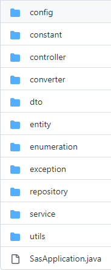

<p align="center">  </p>
<h2 align="center">
Sas - Score Analysis
</h2>

Trabalhei na solução para o desafio proposto pela parceira acadêmica SPC.<br>
A SPC é uma empresa famosa no Brasil que já participou de outros projetos com a FATEC. Nos últimos anos a SPC investiu na análise de dados para auxiliar em decisões financeiras e executivas, além de soluções para clientes que contratam essa inteligência de dados para auxiliar nas suas deciões. <br>
[link para GIT](https://github.com/API-5-SEMESTRE)


#### Tecnologia Utilizadas
- Java SE 11
    - Linguagem de programação escolhida
- GitHub
    - Versionamento do projeto
- Framework Spring Boot
    - Framework do projeto
- Oracle Autonomous Database
    - Banco de dados Cloud para persistência de dados
- Vue
    - Frontend
- Maven
    - Automação da compilação do projeto
- Docker
    - Conteinerização do projeto
- GitHub Actions
    - Ferramenta do GitHub para auxiliar no CI/CD

#### Contribuições Pessoais
Fiquei encarregado de todo o <i>backend</i> em Java do projeto, CI/CD, arquitetura e também me aventurei brevemente no <i>frontend</i>. Novamente escolhi a arquitetura MVC, devido a sua fácil organização e prototipação, desse modo pude começar o projeto de maneira rápida. Com esse começo rápido e mais fácil - já que estava acostumado com o framework e linguagem - pude estudar sobre os princípios do DevOps, utilizando esse estudo para criar o CI/CD do projeto e versionamento no GitHub.
###### - Arquitetura do Sistema
- Uma visão geral da arquitetura do programa. Seguindo o que foi visto no projeto Endurance.
<br>

<br>

###### - <i>Backend</i>
- Fiz todo o backend do projeto, controller, model, service e repository, porém o que eu mais desenvolvi foi a qualidade do código.
- Abaixo é possível clicar e visualizar um exemplo de uma das 3 entidades do código fonte. Podemos ver a utilização da biblioteca <b>Lombok</b> para simplificar e manter o código mais legível eliminando código <i>boilerplate</i> (código recorrente como <i>getters</i> e <i>setters</i>). Também podemos observar a utilização do <i>framework</i> <b>Hibernate</b> sendo utilizado no seu modelo <b>JPA</b> para abstrair e deixar mais simples a comunicação entre o banco de dados e a camada <i>Model</i>. Também temos exemplos de diversos tipos de mapeamento de entidades.
<details>
<summary markdown="span"y>Entidade</summary>

```java
@Entity
@Table(name="empresa")
public class Empresa {
	
	
	public static final String ID = "emp_cnpj";
	public static final String ORIGEM="emp_origem";
	public static final String DATA_CADASTRO_VENDEDOR="emp_data_cadastro_vendedor";
	
	@Id
	@Column(name=ID)
	private Long cnpj;
	
	@ManyToOne
	@JoinColumn(
				name=Cidade.ID
	)
	private Cidade cidade;
	
	@ManyToOne
	@JoinColumn(
				name=Cnae.ID
	)
	private Cnae cnae;
	
	@Column(name=ORIGEM)
	private TipoEmpresa origem;
	
	@Column(name=DATA_CADASTRO_VENDEDOR)
	private LocalDateTime dataDeCadastroVendedor;
	
	@OneToOne
	@JoinColumn(
			name=Usuario.ID,
			referencedColumnName=Usuario.ID,
			nullable = true
			)
	private Usuario usuario;
	
	public Usuario getUsuario() {
		return usuario;
	}

	public void setUsuario(Usuario usuario) {
		this.usuario = usuario;
	}

	public Empresa() {}

	public Long getCnpj() {
		return cnpj;
	}

	public void setCnpj(Long cnpj) {
		this.cnpj = cnpj;
	}

	public Cidade getCidade() {
		return cidade;
	}

	public void setCidade(Cidade cidade) {
		this.cidade = cidade;
	}

	public Cnae getCnae() {
		return cnae;
	}

	public void setCnae(Cnae cnae) {
		this.cnae = cnae;
	}

	public TipoEmpresa getOrigem() {
		return origem;
	}

	public void setOrigem(TipoEmpresa origem) {
		this.origem = origem;
	}

	public LocalDateTime getDataDeCadastroVendedor() {
		return dataDeCadastroVendedor;
	}

	public void setDataDeCadastroVendedor(LocalDateTime dataDeCadastroVendedor) {
		this.dataDeCadastroVendedor = dataDeCadastroVendedor;
	}
	
	public static EmpresaDTO paraDTO(Empresa empresa) {
		EmpresaDTO dto = new EmpresaDTO();
		dto.setCnpj(empresa.getCnpj());
		
		return dto;
	}
}
```
</details>

<details>
<summary markdown="span"y>Controller</summary>

```java
@RestController
@RequestMapping(path = {"/empresa"})
public class EmpresaController extends TratamentoExcecao{
	
	@Autowired
	private TransformarDadosService transformarDadosService;
	@Autowired
	private EmpresaService empresaService;
	@Autowired
	private EmpresaScoreService scoreService;
	
	@PostMapping("/leitor-csv")
	@ResponseStatus(CREATED)
	public List<Empresa> uploadCsv(
			@RequestParam("arquivo") MultipartFile arquivo) {
		final Set<Empresa> empresas = transformarDadosService.transformarDadosEmpresa(arquivo);
		final List<Empresa> empresasSalvas = empresaService.salvarTodosFlush(empresas);
        return empresasSalvas;
	}
	
	@GetMapping("/todas-empresas")
	@ResponseStatus(OK)
	public List<Long> pesquisarTodasEmpresas() {
		return empresaService.findAllCnpj();
	}
	
	@GetMapping("/todas-empresas/{pagina}/{tamanho}")
	@ResponseStatus(OK)
	public Page<Empresa> pesquisarTodasEmpresasPaginacao(@PathVariable int pagina, @PathVariable int tamanho) {
		return empresaService.todasEmpresas(pagina, tamanho);
	}
	
	@GetMapping("/pesquisar-empresa/{cnpj}")
	@ResponseStatus(OK)
	public EmpresaDTO pesquisarEmpresaPorCnpj(@PathVariable("cnpj")Long cnpj) {
		return empresaService.procurarPorCnpj(cnpj);
	}
	
	@GetMapping("/pesquisar-score-por-regiao/{regiao}/{pagina}/{tamanho}/{sort}")
	@ResponseStatus(OK)
	public ResponseEntity<Page<EmpresaScore>> pesquisarScorePorRegiao(@PathVariable("regiao")String regiao,
																		@PathVariable("pagina")int pagina,
																		@PathVariable("tamanho")int tamanho,
																		@PathVariable("sort")int sort) {
		final Page<EmpresaScore> scores = scoreService.procurarPorRegiao(regiao, pagina, tamanho, sort);
		
		return new ResponseEntity<>(scores, OK);
	}
	
	@GetMapping("/pesquisar-score-por-origem/{origem}/{pagina}/{tamanho}/{sort}")
	@ResponseStatus(OK)
	public Page<EmpresaScore> pesquisarScorePorOrigem(@PathVariable("origem")String origem,
																		@PathVariable("pagina")int pagina,
																		@PathVariable("tamanho")int tamanho,
																		@PathVariable("sort")int sort) {
		return scoreService.procurarPorOrigem(origem, pagina, tamanho, sort);
	}
	
	@GetMapping("/pesquisar-score/{cnpj}")
	@ResponseStatus(OK)
	public EmpresaScore pesquisarScorePorCnpj(@PathVariable("cnpj")Long cnpj) {
		return scoreService.procurarPorCnpj(cnpj);
	}
	
	@GetMapping("/pesquisar-score-por-filtro/{regiao}/{origem}/{cnae}/{estado}/{pagina}/{tamanho}/{sort}")
	@ResponseStatus(OK)
	public Page<EmpresaScore> pesquisarScorePorOrigem(@PathVariable(name="regiao", required=true)String regiao,
														@PathVariable(name="origem", required=false)String origem,
														@PathVariable(name="cnae", required=false)String cnae,
														@PathVariable(name="estado", required=false)String estado,
																		@PathVariable("pagina")int pagina,
																		@PathVariable("tamanho")int tamanho,
																		@PathVariable("sort")int sort) {
		return scoreService.procurarPorFiltroCompleto(regiao, origem, cnae, estado, pagina, tamanho, sort);
	}
}
```
</details>

<details>
<summary markdown="span"y>Service</summary>

```java
@Service
public class TransformarDadosServiceImpl implements TransformarDadosService {

	@Autowired
	private EmpresaRepository empresaRepo;
	@Autowired
	private CidadeRepository cidadeRepo;
	@Autowired
	private CnaeRepository cnaeRepo;

	@Override
	public Set<Cidade> transformarDadosCidade(MultipartFile arquivo) {
		List<String[]> linhas = LeitorCSVUtils.carregarDados(arquivo);
		Set<Cidade> cidades = new HashSet<>();

		cidades = construirCidades(linhas);

		return cidades;
	}

	private Set<Cidade> construirCidades(List<String[]> linhas) {
		Set<Cidade> cidades = new HashSet<>();

		linhas.stream().forEach(linha -> {
			Cidade novaCidade = construirCidade(linha[0], linha[1], linha[2], linha[3]);
			cidades.add(novaCidade);
		});

		return cidades;
	}

	private Cidade construirCidade(String id, String desc, String siglaEstado, String ibge) {

		Cidade cidade = new Cidade();
		
		cidade.setId(Long.valueOf(id));
		cidade.setDescricao(desc);
		cidade.setSiglaEstado(siglaEstado);
		cidade.setRegistroIbge(ibge);

		return cidade;
	}
	
	@Override
	public Set<Cnae> transformarDadosCnae(MultipartFile arquivo) {
		List<String[]> linhas = LeitorCSVUtils.carregarDados(arquivo);
		Set<Cnae> cnaes = new HashSet<>();
		
		cnaes = construirCnaes(linhas);

		return cnaes;
	}

	private Set<Cnae> construirCnaes(List<String[]> linhas) {
		Set<Cnae> cnaes = new LinkedHashSet<>();

		linhas.stream().forEach(linha -> {
			Cnae novoCnae = construirCnae(linha[0], linha[1], linha[2]);
			cnaes.add(novoCnae);
		});

		return cnaes;
	}

	private Cnae construirCnae(String id, String codigo, String desc) {

		Cnae cnae = new Cnae();
		
		cnae.setId(Long.valueOf(id));
		cnae.setCodigo(Long.valueOf(codigo));
		cnae.setDescricao(desc);

		return cnae;
	}
	
	@Override
	public Set<Empresa> transformarDadosEmpresa(MultipartFile arquivo) {
		List<String[]> linhas = LeitorCSVUtils.carregarDados(arquivo);
		Set<Empresa> empresas = new HashSet<>();

		empresas = construirEmpresas(linhas);

		return empresas;
	}

	private Set<Empresa> construirEmpresas(List<String[]> linhas) {
		Set<Empresa> empresas = new LinkedHashSet<>();
		final HashMap<Long, Cnae> cnaesMap = construirMapCnaes();
		
		for(String[] linha: linhas) {
			Empresa novaEmpresa = construirEmpresa(linha[0],linha[1],
													linha[2],linha[3],
													cnaesMap);
			empresas.add(novaEmpresa);
		}

		return empresas;
	}

	private Empresa construirEmpresa(String cnpj, String idCidade, 
										String idCnae, String origem,
										HashMap<Long, Cnae> cnaesMap) {

		Empresa empresa = new Empresa();
		Cidade cidade = cidadeRepo.findById(Long.valueOf(idCidade)).get();
		Cnae cnae = null;
		if(StringUtils.isNotBlank(idCnae)) {
			cnae = cnaesMap.get(Long.valueOf(idCnae));
		}

		empresa.setCnpj(Long.valueOf(cnpj));
		empresa.setCidade(cidade);
		empresa.setCnae(cnae);
		Optional<TipoEmpresa> tipo = TipoEmpresa.get(origem);
		empresa.setOrigem(tipo.get());

		return empresa;
	}
	
	@Override
	public Set<Consumo> transformarDadosConsumo(MultipartFile arquivo) {
		List<String[]> linhas = LeitorCSVUtils.carregarDados(arquivo);

		return construirConsumos(linhas);
	}
	
	private Set<Consumo> construirConsumos(List<String[]> linhas) {
		Set<Consumo> consumos = new LinkedHashSet<>();
		
		linhas.stream().forEach(linha -> {
			Consumo consumo = construirConsumo(linha[0], linha[1], linha[2]);
			consumos.add(consumo);
		});

		return consumos;
	}
	
	private Consumo construirConsumo(String mesReferencia, String cnpj, String qtdConsumo) {
		
		Consumo consumo = new Consumo();
		ConsumoId consumoId = new ConsumoId();
		LocalDateTime mes = LocalDateTimeFormatterUtils.padronizarLocalDateTime(mesReferencia);
		Empresa empresa = empresaRepo.findById(Long.valueOf(cnpj)).get();
		
		consumoId.setEmpresa(empresa);
		consumoId.setMesReferencia(mes);
		consumoId.setQuantidadeConsumo(Long.valueOf(qtdConsumo));
		consumo.setConsumoId(consumoId);
		
		return consumo;
	}

	private HashMap<Long, Cnae> construirMapCnaes() {
		HashMap<Long, Cnae> cnaesMap = new HashMap<>();

		List<Cnae> cnaes = cnaeRepo.findAll();

		cnaes.stream().forEach(c -> cnaesMap.put(c.getId(), c));

		return cnaesMap;
	}

}
```
</details>

###### - <i>Unit Test</i>
- Um exemplo de um dos testes feitos para a aplicação, agora com um pouco de experiência obtida do último projeto

<details>
<summary markdown="span">Unit Test</summary>
	
```Java
@SpringBootTest
@Transactional
class TransformarDadosServiceImplTest {

	@Autowired
	private TransformarDadosService service;

	@Test
	@Rollback
	void carregarDadosCidadeDeveFuncionar() {
		//teste
		StringBuilder nomeCaminho = new StringBuilder();
		nomeCaminho.append("./uploads/");
		nomeCaminho.append("base_cidade_teste");
		nomeCaminho.append(".csv");

		Path caminho = Paths.get(nomeCaminho.toString());

		byte[] conteudo = null;

		try {
			conteudo = Files.readAllBytes(caminho);
		} catch (IOException e) {
			e.printStackTrace();
		}

		MultipartFile arquivo = new MockMultipartFile("base_cidade.csv", conteudo);
		
		Set<Cidade> cidades= service.transformarDadosCidade(arquivo);
		
		assertTrue(cidades.size() == 5);
	}
	
	@Test
	@Rollback
	void carregarDadosCnaeDeveFuncionar() {

		StringBuilder nomeCaminho = new StringBuilder();
		nomeCaminho.append("./uploads/");
		nomeCaminho.append("base_cnae_teste");
		nomeCaminho.append(".csv");

		Path caminho = Paths.get(nomeCaminho.toString());

		byte[] conteudo = null;

		try {
			conteudo = Files.readAllBytes(caminho);
		} catch (IOException e) {
			e.printStackTrace();
		}

		MultipartFile arquivo = new MockMultipartFile("base_cnae.csv", conteudo);

		Set<Cnae> cnaes= service.transformarDadosCnae(arquivo);
		
		assertTrue(cnaes.size() == 5);
	}

```
</details>

###### - <i>DevOps</i>
[Link para o DevOps](https://github.com/API-5-SEMESTRE/documentacao/tree/main/documenta%C3%A7%C3%A3o_devops)

#### Hard Skills Efetivamente Desenvolvidas
- [x] DevOps
    - Parte da engenharia de software em avanço no mercado de trabalho, organiza e normatiza o <i>deploy</i> do software
    - Sei fazer com ajuda
- [x] CI/CD
    - Parte do versionamento do projeto, pode ser usado uma ferramenta para auxiliar como Jenkins ou 
    - Sei fazer com ajuda
- [x] Envio de emails
    - Finalmente descobri como funciona!
    - Sei fazer com ajuda
- [x] Teste Unitário
    - Utilizado para garantir qualidade e confiabilidade do código, importante para o CI/CD do projeto
    - Sei fazer com ajuda

#### Soft Skills
- Precisei de muita <b>organização</b> nesse projeto, seja na vida pessoal ou no código - para <b>gerenciar</b> toda a programação do <b>backend</b>. O projeto foi separado entre <i>frontend</i> e <i>backend</i> foi necessário muito <b>trabalho em equipe</b> para a comunicação das duas partes funcionar de maneira adequada, a <b>empatia</b> também foi essencial já que alguns membros do time tiveram vários problemas durante o semestre, precisei entender os seus motivos e executar alguns trabalhos fora do meu escopo.
