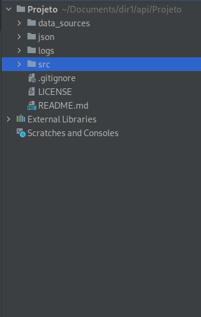

<p align="center">  </p>
<h2 align="center">
CATE - Collect Analyze Treatment Exhibition
</h2>

Trabalhei na solução para o desafio proposto pela parceira acadêmica Dom Rock.<br>
A Dom Rock é uma empresa que proporciona ao cliente, por meio de análise de dados, a potencialização de suas estratégias comerciais e melhora a eficiência de mercado. O desafio proposto pela Dom Rock: o cliente gerencia um sistema de gestão de planos de saude que possui a necessidade de uma solução que concilie as informações oriundas de demonstrativo de uma operadora de saúde e a lista de beneficiários dos planos de saúde dessa operadora para cada competência (mensal). Como os dados contém informações pessoais é mandatório a aplicação de regras LGPD (Lei Geral de Proteção de Dados Pessoais) para efeito de auditoria.<br>
[link para GIT](https://github.com/API-6-SEMESTRE)


#### Tecnologia Utilizadas
- Python
    - Linguagem de programação escolhida
- GitHub
    - Versionamento do projeto
- Pandas
    - Biblioteca utilizada para análise de dados
- MySql
    - Banco de dados para persistência da Data Warehouse projetada pelo grupo
- PLSQL
    - Linguagem de persistência de dados do framework hibernate


#### Contribuições Pessoais
Fiquei encarregado do <i>ETL</i> (<i>Extract, transform, load</i>) em python, do log para capturar informações pertinentes do processo (como dados importantes faltantes ou erro no processo) e do script da nossa <i>Data Warehouse</i> onde o resultado final de todo a <i>pipeline</i> foi armazenado.
###### - Arquitetura do Sistema
- Uma visão geral da arquitetura do programa.
<br>

<br>

###### - <i>ETL</i>
- O <i>ETL</i> foi dividido em 3 processos:
	- Bronze: filtra colunas que não possuem dados chaves e persiste no banco.
	- Silver: trabalho de análise de dados solicitado e novamente persistência no banco.
	- Gold: construção das entidades e persistência na <i>Data Warehouse</i>.
- Abaixo é possível clicar e visualizar o processo gold.
<details>
<summary markdown="span"y>Processo gold</summary>

```Python
#Algumas funções para auxiliar no processo de construção das entidades
def to_date(x):
    if x == 'NaT' or x is None:
        return None
    return datetime.strptime(x, '%Y-%m-%d %H:%M:%S')


def get_id():
    return cursor.lastrowid


def to_int(x):
    if x is None or x == 'nan':
        return None
    return int(x)


def to_float(x):
    if x is None or x == 'nan':
        return None
    return float(x)


#Exemplo de contrução da entidade, foi passado a linha do document extraído do mongo
#e verificado as colunas pertinentes ao dw
def build_fatura(line):
    fatura = {}
    colunas = ['dt_competencia', 'numero_fatura', 'rubrica', 'parcela_1', 'dt_geracao']
    for coluna in colunas:
        if coluna not in line.keys():
            line[coluna] = None

    fatura['competencia'] = to_date(line['dt_competencia'])
    fatura['numero_fatura'] = to_int(line['numero_fatura'])
    fatura['rubrica'] = line['rubrica']
    fatura['parcela'] = to_float(line['parcela_1'])
    fatura['dt_geracao'] = to_date(line['dt_geracao'])

    return fatura


#Processo de persistência dos dados no dw
def save_faturas(fatura):
    sql = "insert into api.fatura(competencia, numero_fatura, rubrica , parcela, dt_geracao ) " \
          "values(%s,%s,%s,%s,%s) "

    cursor.execute(sql,
                   [fatura['competencia'],
                    fatura['numero_fatura'],
                    fatura['rubrica'],
                    fatura['parcela'],
                    fatura['dt_geracao']])

    print(get_id())
    api_db.commit()
    return get_id()
```
</details>

###### - <i>Opções ao executar o script</i>
- Como o script foi feito para ser executado via linha de comando, achei pertinente incluir opções para a execução, como a opção -q (<i>quiet</i>) para omitir algumas partes do log ou -v (<i>verbose</i>) para mostrar todo o processo do log no terminal. Também foi adicionado 3 opções, bronze, silver ou gold, para o usuário escolher qual processo ele deseja executar.
<details>
<summary markdown="span"y>Opções para o Script</summary>

```Python
parser = argparse.ArgumentParser(description='ETL process for excel data')
parser.add_argument('-l', '--level', type=str, metavar='', required=True,
                    choices=['bronze', 'silver', 'gold'], help='Level of ETL (bronze, silver, gold)')
group = parser.add_mutually_exclusive_group()
group.add_argument('-q', '--quiet', action='store_true', help='print quiet')
group.add_argument('-v', '--verbose', action='store_true',
                   help='print verbose')
args = parser.parse_args()
```
</details>

###### - Script da <i>Data Warehouse</i>

<details>
<summary markdown="span">Script</summary>
	
```Sql
create database api;

use api;

create table fatura (
    id_fat bigint not null auto_increment,
    competencia date,
    numero_fatura bigint,
    rubrica varchar(100),
    parcela bigint,
    dt_geracao date,
    primary key(id_fat)
);

create table convenio (
    id_conv bigint not null auto_increment,
    codigo_convenio bigint,
    convenio varchar(150),
    operadora varchar(50),
    primary key(id_conv)
);

create table beneficiario (
    id_seg bigint not null auto_increment,
    tipo varchar(1),
    nome varchar(50),
    marca_otica bigint,
    dt_nascimento date,
    primary key(id_seg)
);

create table contrato (
    id_cont bigint not null auto_increment,
    plano varchar(100),
    num_contrato bigint,
    situacao varchar(50),
    dependente bigint,
    dt_cancelamento date,
    dt_situacao date,
    inicio_vigencia date,
    dt_suspensao date,
    primary key(id_cont)
);

create table tempo (
    id_dat bigint not null auto_increment,
    data date not null,
    primary key(id_dat)
);

create table fato (
    id_fato bigint not null auto_increment,
    id_cont bigint not null,
    id_fat bigint not null,
    id_seg bigint not null,
    id_dat bigint not null,
    id_conv bigint not null,
    mensalidade float(10,2),
    repasse float(10,2),
    caso varchar(50),
    primary key(id_fato),
    constraint fk_id_cont
    foreign key (id_cont)
    references contrato (id_cont),
    constraint fk_id_fat
    foreign key (id_fat)
    references fatura (id_fat),
    constraint fk_id_seg
    foreign key (id_seg)
    references beneficiario (id_seg),
    constraint fk_id_dat
    foreign key (id_dat)
    references tempo (id_dat),
    constraint fk_id_conv
    foreign key (id_conv)
    references convenio (id_conv)
);

```
</details>


#### Hard Skills Efetivamente Desenvolvidas
- [x] Python
    - Eu já conhecia bastante da linguagem porém pude praticar alguns conceitos que não são utilizados comumente, como opção ao rodar o script pelo terminal
    - Sei fazer com autonomia
- [x] Pandas
    - A biblioteca foi muito utilizada no processo de <i>ETL</i> bronze para navegar de forma fácil no arquivo xls
    - Sei fazer com ajuda
- [x] MySql
    - Pude praticar um pouco de MySql, é sempre interessante ver as diferenças entre uma linguagem sql e outra
    - Sei fazer com ajuda
- [x] PL/SQL
    - Pude colocar em prática o que aprendi no mercado de trabalho!
    - Sei fazer com autonomia

#### Soft Skills
Primeiro precisei ser <b>flexível</b> e aceitar trabalhar com outra linguagem que não fosse Java, mas sem dúvidas o que mais pratiquei nesse projeto foi a <b>empatia</b>, pois, sendo o último semestre, todos do grupo estavam muito atarefados, dessa forma foi necessário <b>compreender</b> os impedimentos e dores de cada membro do grupo.
