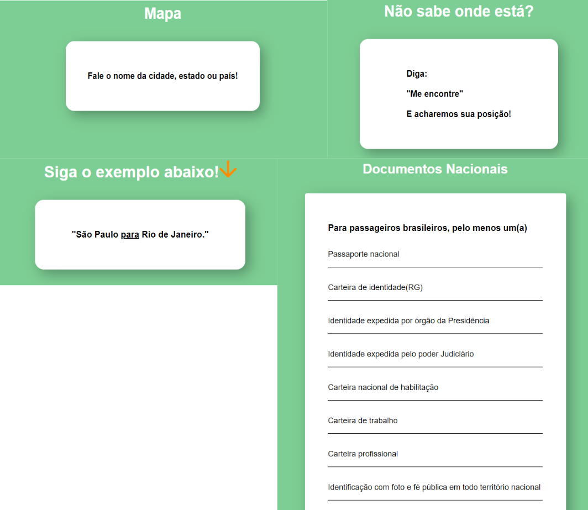
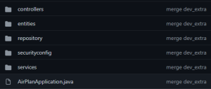
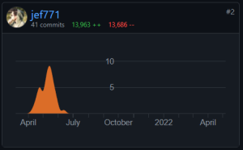
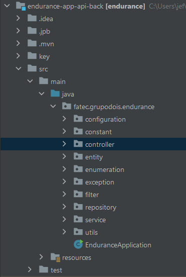

<p align="center">  </p>

Estudante de Banco de Dados pela FATEC São José dos Campos, estagiário fullstack em Java e estas são minhas experiências no desenvolvimento da API.

# Meus Projetos
<hr>

### Em 2020-1
Tabalhei no projeto proposto pelos professores das materias focais do primeiro semestre do curso de Banco de Dados, uma assistente virtual guiada por comando de voz.<br>
Foi dada total liberdade na escolha de tecnologia a ser utilizada no projeto e uma parceria com alunos do sexto semestre, para passarem suas experiências na forma de <i>Scrum Masters</i>.<br>
Tive muita sorte pois a Ariene foi uma ótima <i>Scrum Master</i>, orientando com grande eficácia e praticidade nossa equipe que por muitas vezes desviava do conceito inicial do projeto - tentando adicionar novas tecnologias ou <i>features</i> que não tinhamos conhecimento necessário para implementar.<br>
Com toda a liberdade dada - o único ponto não opicional era a implementação de, no mínimo, 5 <i>features</i> - foi interessante testar nossos conhecimentos e quebrar barreiras.<br>
[link para o GIT](https://github.com/arienemaiara/assistente-voz-viagens)

#### Tecnologias Utilizadas
 HTML, Javascript, CSS (os pilares do <i>frontend</i>) e GitHub

#### Contribuições Pessoais
Fui responsável pelo UI-UX, desenvolvimento das páginas e a produção de algumas <i>features</i>.

###### <i>- UI-UX</i>
- Utilizei o design de cards e sombreamento para o ux, a ideia é que o usuário abra a página e já entenda que existe diferentes funções.
<br>

<br>

<br>

###### <i>- Features</i>
- Também executei algumas das <i>features</i>:
<br>

<br>
- Mapa, função simples que usava o javaScript para mostrar o destino falado pelo usuário, documento, outra função simples para abrir uma página contendo os documentos necessários para voos nacionais e internacionais, posição, usava uma api do google para mostrar a posição do usuário no google Maps, trajeto, uma função um pouco mais complexa, mostrava o trajeto que o usuário pedia por exemplo: "São Paulo para Rio de Janeiro".

#### Hard Skills Efetivamente Desenvolvidas
HTML, Javascript, CSS e Git Flow

- <b>HTML e CSS</b>
    - Fiz todo o trabalho de design de UI/UX e a implementei
- <b>javaScript</b>
    - Foi necessário aprender o básico para executar as tarefas de <b>backend</b> para as funções da tela
- <b>Git Flow</b>
    - Quem diria que algo que eu aprendi no primeiro semestre iria ajudar tanto na minha carreira! Aprendizado de Git e Git Flow foi importantíssimo!

#### Soft Skills Efetivamente Desenvolvidas
Proatividade<br>
Em muitos momentos precisei procurar o conhecimento, seja em vídeos de youtube, livros ou cursos, para conseguir desenvolver as <i>features</i>, design e <i>frontend</i>i>. 


<hr>

### Em 2020-2
Trabalhei no projeto da API com o Parceiro Acadêmico TecSUS.<br>
A empresa produz soluções tecnológicas para transmissão e recepção de dados, controle, gestão de faturas e até mesmo equipamentos remotos voltados para os setores de abastecimento de água, distribuição de eletricidade e gás natural.<br>
Visto que a gestão de faturas pode ser algo complicado pela falta de padrão das empresas envolvidas no setor a TecSUS precisava de uma ferramenta para digitalizar um grande volume de contas.<br>
O projeto, Desktop App, foi feito totalmente em Java e foi focado em ajudar o processo de digitação de contas que não seguiam o padrão do sistema de digitalização automática de contas.<br>
Esse, sem dúvida, foi o projeto mais bem coordenado, todos os professores estavam em sintonia, assim sendo um projeto tranquilo para a implementação.<br>
[link para GIT](https://github.com/MikeBBatista/pi-fatec-java)

#### Tecnologias Utilizadas
Java, MySQL, IDE Eclipse Java

#### Contribuições Pessoais
Fui responsável pelo DAO - Objeto ou classe de acesso a dados, ele que conectava ao banco e fazia as transações -, como a intenção do trabalho era usar Java puro, trabalhei muito com o POO (programação orientada a objetos), lógica de programação, criação de query e JDBC para chegar até as soluções dos problemas.

###### - <i>DAO</i> e <i>Controller</i>
- A seguir é possível clicar e ler alguns trechos de código, foi a primeira vez que tive contato com arquitetura MVC, são exemplos concisos de tudo de novo que vi no projeto, MVC, conexão JDBC e comunicação com o frontend!

<details>
  <summary markdown="span">DAO</summary>

  ```java
  public class LightAccountDao {
	
	public static Integer save(LightAccount light) {
		
		Integer result = 0;
		String sql = "Insert into LIGHT_ACCOUNT (LIGHT_IDENT_COD, "
				+ "LIGHT_METER_NUMBER, "
				+ "LIGHT_INVOICE, "
				+ "LIGHT_CURRENT_DATE, "
				+ "LIGHT_DUE_DATE, "
				+ "LIGHT_CONSUMPTION_DAYS, "
				+ "LIGHT_FLAG_TYPE, "
				+ "LIGHT_CONSUMPTION_VALUE, "
				+ "LIGHT_PIS_PERCENTAGE, "
				+ "LIGHT_COFINS_PERCENTAGE, "
				+ "LIGHT_ICMS_BASIS, "
				+ "LIGHT_ICMS_PERCENTAGE, "
				+ "LIGHT_ICMS_VALUE, "
				+ "LIGHT_PIS_COFINS_BASIS, "
				+ "LIGHT_PIS_VALUE, "
				+ "LIGHT_COFINS_VALUE, "
				+ "LIGHT_FORFEIT_VALUE, "
				+ "LIGHT_INTEREST_VALUE, "
				+ "LIGHT_OTHER_VALUES, "
				+ "LIGHT_SUPPLY_VALUES, "
				+ "LIGHT_FINANCIAL_ITEMS, "
				+ "LIGHT_AMOUNT, "
				+ "LIGHT_SUPPLIER_CNPJ,"
				+ "LIGHT_USER_ID,"
				+ "LIGHT_ALTER_BY) "
				+ "VALUES (?, ?, ?, ?, ?, ?, ?, ?, ?, ?, ?, ?, ?, ?, ?, ?, ?, ?, ?, ?, ?, ?, ?, ?, ?)";
		
		try {
			BaseConnection con = new BaseConnection();
			PreparedStatement saveValues = con.connection.prepareStatement(sql);
			
			saveValues.setInt(1, light.getIdentCod());
			saveValues.setInt(2, light.getMeterNumber());
			saveValues.setString(3, light.getInvoice());
			saveValues.setString(4, light.getCurrentDate());
			saveValues.setString(5, light.getDueDate());
			saveValues.setInt(6, light.getConsumptionDays());
			saveValues.setString(7, light.getFlagType());
			saveValues.setBigDecimal(8, light.getConsumptionValue());
			saveValues.setBigDecimal(9, light.getPisPercentage());
			saveValues.setBigDecimal(10, light.getCofinsPercentage());
			saveValues.setBigDecimal(11, light.getIcmsBasis());
			saveValues.setBigDecimal(12, light.getIcmsPercentage());
			saveValues.setBigDecimal(13, light.getIcmsValue());
			saveValues.setBigDecimal(14, light.getPisCofinsBasis());
			saveValues.setBigDecimal(15, light.getPisValue());
			saveValues.setBigDecimal(16, light.getCofinsValue());
			saveValues.setBigDecimal(17, light.getForfeitValue());
			saveValues.setBigDecimal(18, light.getInterestValue());
			saveValues.setBigDecimal(19, light.getOtherValues());
			saveValues.setBigDecimal(20, light.getSupplyValue());
			saveValues.setBigDecimal(21, light.getFinancialItems());
			saveValues.setBigDecimal(22, light.getAmount());
			saveValues.setLong(23, light.getSupplierCnpj());
			saveValues.setInt(24, light.getCreatedBy());
			saveValues.setInt(25, light.getAlterBy());
			
			result = saveValues.executeUpdate();
		}
		catch(SQLException err) {
			System.out.println(err);
		}
		
		return result;
	}		
 ```
</details>

<details>
  <summary markdown="span">Controller</summary>

  ```java
  public class LightAccountController {
	
	public static void saveValues(Integer identCod, Integer meterNumber, String invoice, String currentDate,
			String dueDate, Integer consumptionDays, String flagType, BigDecimal consumptionValue, BigDecimal pisPercentage,
			BigDecimal cofinsPercentage, BigDecimal icmsBasis, BigDecimal icmsPercentage, BigDecimal icmsValue,
			BigDecimal pisCofinsBasis, BigDecimal pisValue, BigDecimal cofinsValue, BigDecimal forfeitValue,
			BigDecimal interestValue, BigDecimal otherValues, BigDecimal supplyValue, BigDecimal financialItems,
			BigDecimal amount, Long supplierCnpj, Integer createdBy, Integer alterBy) {
		
		LightAccount light = new LightAccount(identCod, meterNumber, invoice, currentDate, dueDate, consumptionDays,
				flagType, consumptionValue, pisPercentage, cofinsPercentage, icmsBasis, icmsPercentage, icmsValue,
				pisCofinsBasis, pisValue, cofinsValue, forfeitValue, interestValue, otherValues, supplyValue,
				financialItems, amount, supplierCnpj, createdBy, alterBy);
		
		
		if(LightAccountDao.save(light) == 1) {
			
			showMessageDialog(null, "Dados cadastrados com Sucesso!");
		}
	}
			public static List <LightAccount> getValues (String identCod){
				List <LightAccount> lightAccounts = LightAccountDao.listLightAccounts(identCod);
				return lightAccounts;
			}
		
			public static void updateValues (LightAccount lightaccount) {
				if (LightAccountDao.update(lightaccount) == 1) {
					showMessageDialog(null, "Dados alterados com sucesso!");
				}
				else {
					showMessageDialog(null,"Dados do tipo incorreto, verifique e tente novamente");
				}
			}
			
 		}	
 ```
</details>
	


#### Hard Skills Efetivamente Desenvolvidas
- <b>Java</b>
    - Nesse projeto que um dos requisitos dos professores era a utilização do Java puro pude treinar o uso de pacotes do jdk como utils e lang.
- Lógica de Programação
- <b>JDBC</b>
    - Para comunicação entre <b>backend</b> e banco de dados.
- <b>SQL</b>
    - Foi preciso escrever cada query!

#### Soft Skills Efetivamente Desenvolvidas
Trabalho em equipe<br>
Esse foi o projeto que mais trabalhei em equipe, ajudando membros do grupo com problemas no desenvolvimento.

<hr>

### Em 2021-1
Trabalhei no projeto da API com o Parceiro Acadêmico Embraer.<br>
A Embraer é uma empresa renomada e importantíssima para o Brasil, produzindo aeronaves que são exportadas para dezenas de países e também utilizadas em solo brasileiro. Com o grande número de aeronaves produzidas, a construção e manutenção da documentação da aeronave - que pode chegar a milhares de páginas - torna-se algo complexo, portanto procuravam uma solução digital e moderna para a varredura e montagem de PDFs e leitura automatizada de Excel.<br>
O que foi muito marcante nesse projeto foi todo o auxílio que os professores deram, em Hard Skill e Soft Skill.
[link para GIT](https://github.com/GabrielSG20/Projeto_Integrador_3BD-1Sem2021)

#### Tecnologia Utilizadas
Java SE 8, MySQL, IDE Eclipse, GitHub, IText, Maven e Framework Springboot

#### Contribuições Pessoais
Fui responsável pela maioria do <b>backend</b>, pela arquitetura MVC, regras de serviço e "raspagem" de dados.

###### - Arquitetura do Sistema (MVC)
<br>

<br>

###### - Regras de Serviço
- Porém o maior desafio foi a lógica de programação para executar a raspagem de dados dos manuais em formato pdf, usei muito a biblioteca externa <i>itextpdf</i>, lógica de programação e conhecimento em estruturas de dados como Listas e Mapas.
<details>
  <summary markdown="span">Controller</summary>
	
```java
@Controller
public class LEPController {

    private final LepService lepService;

    public LEPController(LepService lepService) {
        this.lepService = lepService;
    }

    @RequestMapping("/lep-create")
    public String showLepCreatePage(Model model) {
        Lep lep = new Lep();
        model.addAttribute("lep", lep);


        return "lep-create";
    }

    @PostMapping(value = "/lep-create")
    public String createLep(@ModelAttribute("lep") Lep lep,
                            RedirectAttributes redirAttrs) throws IOException {


        if(!lepService.checkIntegrity(lep)) {
            redirAttrs.addFlashAttribute("error", "Incorrect data, check" +
                    " fields integrity, eg.: all fields are filled?");
            return "redirect:/lep-create";
        }

        lepService.createLep1(lep);
        redirAttrs.addFlashAttribute("success", "LEP successfully created!");

        return "redirect:/lep-create";
    }
}
```
</details>

<details>
  <summary markdown="span">Repository</summary>
	
```java
@Repository
public interface ManualRepository extends JpaRepository<Manual, Integer> {
    @Query(" select mnl_id from Manual where mnl_name = ?1 ")
    Integer findManualByName(String nomeManual);
    @Query("select count(mnl_id) from Manual where mnl_name = ?1")
    Long checkCount(String nomeManual);
}
```
</details>
	
<details>
  <summary markdown="span">Service (raspagem de dados!)</summary>
	
```java
@Service
public class LepService
{
    private final ManualService manualService;
    private final CodeListService codeListService;
    private String currentRevision;

    @Autowired
    public LepService(ManualService manualService, CodeListService codeListService) {
        this.manualService = manualService;
        this.codeListService = codeListService;
        this.currentRevision = "";
    }

    public boolean checkIntegrity(Lep lep) {

        if(lep.getRevision_dates().length() == 0) {
            return false;
        } else if(lep.getCdl_code().length() == 0){
            return false;
        } else if(lep.getMnl_name().length() == 0) {
            return false;
        } else return lep.getFlg_tag().length() != 0;
    }

    public void createLep1(final Lep lep) throws IOException {
        List<String> filterRevisionDates = new ArrayList<>();
        final String[] rvParts = lep.getRevision_dates().split("-");
        for (int i = 0; i < rvParts.length; ++i) {
            StringBuilder rvFinal = new StringBuilder();
            for (int j = 0; j < rvParts[i].length(); ++j) {
                rvFinal.append(rvParts[i].charAt(j));
                if (j == 7 || j == 8) {
                    rvFinal.append(".................");
                }
                if(i == rvParts.length-1 && j <= 8) {
                    if(Character.isDigit(rvParts[i].charAt(j))) {
                        if(Character.isDigit(rvParts[i].charAt(j+1))) {
                            currentRevision+= " ";
                        } else {
                            currentRevision+=" 0";
                        }
                    }
                    currentRevision+=rvParts[i].charAt(j);
                }
            }
            filterRevisionDates.add(rvFinal.toString());
        }

        final Integer mnl_id = this.manualService.findManualByName(lep.getMnl_name());
        this.createLep2(lep, mnl_id, filterRevisionDates);
    }

    public void addCell(String block, String code, Integer page,
                        String change, Table table, Integer lastPage) {

        if (page == 1) {
            table.addCell(new Cell().add(block).setBorder(Border.NO_BORDER).setTextAlignment(TextAlignment.CENTER)
                    .setBorderTop(new SolidBorder(0.5f)));
            table.addCell(new Cell().add(code).setBorder(Border.NO_BORDER).setTextAlignment(TextAlignment.CENTER)
                    .setBorderTop(new SolidBorder(0.5f)));
            table.addCell(new Cell().add(String.valueOf(page)).setBorder(Border.NO_BORDER).setTextAlignment(TextAlignment.CENTER)
                    .setBorderTop(new SolidBorder(0.5f)));
            if (change.equals(currentRevision)) {
                table.addCell(new Cell().add("*").setBorder(Border.NO_BORDER)
                        .setBorderTop(new SolidBorder(0.5f)));
            } else {
                table.addCell(new Cell().add("").setBorder(Border.NO_BORDER).setTextAlignment(TextAlignment.CENTER)
                        .setBorderTop(new SolidBorder(0.5f)));
            }
            table.addCell(new Cell().add(change).setBorder(Border.NO_BORDER).setTextAlignment(TextAlignment.CENTER)
                    .setBorderTop(new SolidBorder(0.5f)));

        } else if (page == lastPage) {
            table.addCell(new Cell().add(block).setBorder(Border.NO_BORDER).setTextAlignment(TextAlignment.CENTER)
                    .setBorderBottom(new SolidBorder(0.5f)));
            table.addCell(new Cell().add(code).setBorder(Border.NO_BORDER).setTextAlignment(TextAlignment.CENTER)
                    .setBorderBottom(new SolidBorder(0.5f)));
            table.addCell(new Cell().add(String.valueOf(page)).setBorder(Border.NO_BORDER).setTextAlignment(TextAlignment.CENTER)
                    .setBorderBottom(new SolidBorder(0.5f)));
            if (change.equals(currentRevision)) {
                table.addCell(new Cell().add("*").setBorder(Border.NO_BORDER)
                        .setBorderBottom(new SolidBorder(0.5f)));
            } else {
                table.addCell(new Cell().add("").setBorder(Border.NO_BORDER).setTextAlignment(TextAlignment.CENTER)
                        .setBorderBottom(new SolidBorder(0.5f)));
            }
            table.addCell(new Cell().add(change).setBorder(Border.NO_BORDER).setTextAlignment(TextAlignment.CENTER)
                    .setBorderBottom(new SolidBorder(0.5f)));
        } else {
            table.addCell(new Cell().add(block).setBorder(Border.NO_BORDER)).setTextAlignment(TextAlignment.CENTER);
            table.addCell(new Cell().add(code).setBorder(Border.NO_BORDER)).setTextAlignment(TextAlignment.CENTER);
            table.addCell(new Cell().add(String.valueOf(page)).setBorder(Border.NO_BORDER)).setTextAlignment(TextAlignment.CENTER);
            if (change.equals(currentRevision)) {
                table.addCell(new Cell().add("*").setBorder(Border.NO_BORDER));
            }
            else {
                table.addCell(new Cell().add("").setBorder(Border.NO_BORDER)).setTextAlignment(TextAlignment.CENTER);
            }
            table.addCell(new Cell().add(change).setBorder(Border.NO_BORDER)).setTextAlignment(TextAlignment.CENTER);
        }
    }


    public void createLep2(Lep lep, final Integer mnlId,
                            List<String> filterRevisionDates) throws IOException {

        final String code, manualName, flgTag;
        code = lep.getCdl_code();
        manualName = lep.getMnl_name();
        flgTag = lep.getFlg_tag();

        List<CodeList> listCode1 = this.codeListService.filtroLep(mnlId, flgTag);
        String destPath = String.valueOf(Paths.get("./manuals/" + manualName.toUpperCase() + "-00-02c" + code + ".pdf"));
        final Paragraph paragraph1 = new Paragraph("LIST OF EFFECTIVE PAGES");
        final PdfWriter pdfWriter = new PdfWriter(destPath);
        final PdfDocument pdfDocument = new PdfDocument(pdfWriter);
        pdfDocument.addNewPage();
        final Document document = new Document(pdfDocument, PageSize.A4,false);
        document.setTopMargin(40f);
        document.add(paragraph1.setTextAlignment(TextAlignment.CENTER).setBold().setFontSize(18.0f));
        for (Object s2 : filterRevisionDates) {
            final Paragraph temp = new Paragraph(String.valueOf(s2));
            temp.setMultipliedLeading(0.5f);
            document.add(temp.setTextAlignment(TextAlignment.CENTER).setFontSize(12.0f));
        }

        // Create and select next page
        document.add(new AreaBreak(AreaBreakType.NEXT_PAGE));

        document.showTextAligned(new Paragraph(String.format("INTENTIONALLY BLANK")).setFontSize(14),
                300, 500, 2, TextAlignment.CENTER,
                VerticalAlignment.MIDDLE, 0);


        HashMap<String, ArrayList<String>> lepTable = new HashMap<>();
        ArrayList<String> coverList = new ArrayList<>();
        lepTable.put("01 Cover", coverList);
        ArrayList<String> tocList = new ArrayList<>();
        lepTable.put("03 Table of Contents", tocList);
        ArrayList<String> storyList = new ArrayList<>();
        lepTable.put("02 Story", storyList);
        ArrayList<String> chapterList = new ArrayList<>();
        lepTable.put("03 Chapter", chapterList);
        ArrayList<String> middleList = new ArrayList<>();
        lepTable.put("04 Middle", middleList);
        ArrayList<String> generalDataList = new ArrayList<>();
        lepTable.put("05 General Data", generalDataList);
        ArrayList<String> appendixList = new ArrayList<>();
        lepTable.put("AP01 Appendix", appendixList);
        ArrayList<String> supplementList = new ArrayList<>();
        lepTable.put("S03 Supplement", supplementList);
        try {
            Stream<Path> filepath = Files.walk(Paths.get("./manuals/" + manualName + "/Master/"));
            try {
                filepath.forEach(s -> {
                    String tempStr = s.toString();
                    for (CodeList y: listCode1) {
                        if (tempStr.contains(y.getCdl_block_name()) && tempStr.contains(".pdf")) {
                            if (y.getCdl_code() < 10) {
                                if (tempStr.contains("01 Cover")) {
                                    if (tempStr.contains("c0" + y.getCdl_code())) {
                                        lepTable.get("01 Cover").add(tempStr);
                                    }
                                }
                                else if (tempStr.contains("03 Table of Contents")) {
                                    if (tempStr.contains("c0" + y.getCdl_code())) {
                                        lepTable.get("03 Table of Contents").add(tempStr);
                                    }
                                }
                                else if (tempStr.contains("02 Story")) {
                                    if (tempStr.contains("c0" + y.getCdl_code())) {
                                        lepTable.get("02 Story").add(tempStr);
                                    }
                                }
                                else if (tempStr.contains("03 Chapter")) {
                                    if (tempStr.contains("c0" + y.getCdl_code())) {
                                        lepTable.get("03 Chapter").add(tempStr);
                                    }
                                }
                                else if (tempStr.contains("04 Middle")) {
                                    if (tempStr.contains("c0" + y.getCdl_code())) {
                                        lepTable.get("04 Middle").add(tempStr);
                                    }
                                }
                                else if (tempStr.contains("05 General Data")) {
                                    if (tempStr.contains("c0" + y.getCdl_code())) {
                                        lepTable.get("05 General Data").add(tempStr);
                                    }
                                }
                                else if (tempStr.contains("AP01 Appendix")) {
                                    if (tempStr.contains("c0" + y.getCdl_code())) {
                                        lepTable.get("AP01 Appendix").add(tempStr);
                                    }
                                }
                                else if (tempStr.contains("S03 Supplement")) {
                                    if (tempStr.contains("c0" + y.getCdl_code())) {
                                        lepTable.get("S03 Supplement").add(tempStr);
                                    }
                                }
                            }
                            else {
                                if (tempStr.contains("Cover")) {
                                    if (tempStr.contains("c" + y.getCdl_code())) {
                                        lepTable.get("01 Cover").add(tempStr);
                                    }
                                }
                                else if (tempStr.contains("03 Table of Contents")) {
                                    if (tempStr.contains("c" + y.getCdl_code())) {
                                        lepTable.get("03 Table of Contents").add(tempStr);
                                    }
                                }
                                else if (tempStr.contains("02 Story")) {
                                    if (tempStr.contains("c" + y.getCdl_code())) {
                                        lepTable.get("02 Story").add(tempStr);
                                    }
                                }
                                else if (tempStr.contains("03 Chapter")) {
                                    if (tempStr.contains("c" + y.getCdl_code())) {
                                        lepTable.get("03 Chapter").add(tempStr);
                                    }
                                }
                                else if (tempStr.contains("04 Middle")) {
                                    if (tempStr.contains("c" + y.getCdl_code())) {
                                        lepTable.get("04 Middle").add(tempStr);
                                    }
                                }
                                else if (tempStr.contains("05 General Data")) {
                                    if (tempStr.contains("c" + y.getCdl_code())) {
                                        lepTable.get("05 General Data").add(tempStr);
                                    }
                                }
                                else if (tempStr.contains("AP01 Appendix")) {
                                    if (tempStr.contains("c" + y.getCdl_code())) {
                                        lepTable.get("AP01 Appendix").add(tempStr);
                                    }
                                }
                                else if (tempStr.contains("S03 Supplement")) {
                                    if (tempStr.contains("c" + y.getCdl_code())) {
                                        lepTable.get("S03 Supplement").add(tempStr);
                                    }
                                }
                            }
                        }
                        else if (tempStr.contains("03 Table of Contents") && y.getCdl_block_name().equals("TOC") && tempStr.contains(".pdf")) {
                            if (y.getCdl_code() < 10) {
                                if (tempStr.contains("03 Table of Contents")) {
                                    if (tempStr.contains("c0" + y.getCdl_code())) {
                                        lepTable.get("03 Table of Contents").add(tempStr);
                                    }
                                }
                            }
                            else if (tempStr.contains("03 Table of Contents")) {
                                if (tempStr.contains("c" + y.getCdl_code())) {
                                    lepTable.get("03 Table of Contents").add(tempStr);
                                }
                            }
                        }
                    }
                });
                if (filepath != null) {
                    filepath.close();
                }
            }
            catch (Throwable t) {
                if (filepath != null) {
                    try {
                        filepath.close();
                    }
                    catch (Throwable exception) {
                        t.addSuppressed(exception);
                    }
                }
                throw t;
            }
        }
        catch (IOException e) {
            throw new IOException("Directory Not Present!");
        }

        // sort dict
        lepTable.forEach((key, value) -> Collections.sort(value));

        document.add(new AreaBreak(AreaBreakType.NEXT_PAGE));
        float[] columnWidths = { 60.0f, 60.0f, 60.0f, 90.0f, 60.0f };
        Table table = new Table(columnWidths);
        table.addCell(new Cell().add("Block").setBorder(Border.NO_BORDER).setBorderBottom(new SolidBorder(0.5f))
                .setBorderTop(new SolidBorder(0.5f)).setTextAlignment(TextAlignment.CENTER));
        table.addCell(new Cell().add("Code").setBorder(Border.NO_BORDER).setBorderBottom(new SolidBorder(0.5f))
                .setBorderTop(new SolidBorder(0.5f)).setTextAlignment(TextAlignment.CENTER));
        table.addCell(new Cell().add("Page").setBorder(Border.NO_BORDER).setBorderBottom(new SolidBorder(0.5f))
                .setBorderTop(new SolidBorder(0.5f)).setTextAlignment(TextAlignment.CENTER));
        table.addCell(new Cell().add("    ").setBorder(Border.NO_BORDER).setBorderBottom(new SolidBorder(0.5f))
                .setBorderTop(new SolidBorder(0.5f)).setTextAlignment(TextAlignment.CENTER));
        table.addCell(new Cell().add("Change").setBorder(Border.NO_BORDER).setBorderBottom(new SolidBorder(0.5f))
                .setBorderTop(new SolidBorder(0.5f)).setTextAlignment(TextAlignment.CENTER));
        if (lepTable.get("01 Cover") != null) {
            table.addCell(new Cell().add("0-TITLE").setBorder(Border.NO_BORDER)
                    .setBorderBottom(new SolidBorder(0.5f))
                    .setBorderTop(new SolidBorder(0.5f)).setTextAlignment(TextAlignment.CENTER));
            table.addCell(new Cell().add("00").setBorder(Border.NO_BORDER)
                    .setBorderBottom(new SolidBorder(0.5f))
                    .setBorderTop(new SolidBorder(0.5f)).setTextAlignment(TextAlignment.CENTER));
            table.addCell(new Cell().add("cover").setBold().setBorder(Border.NO_BORDER)
                    .setBorderBottom(new SolidBorder(0.5f))
                    .setBorderTop(new SolidBorder(0.5f)).setTextAlignment(TextAlignment.CENTER));
            table.addCell(new Cell().add("*").setBorder(Border.NO_BORDER)
                    .setBorderBottom(new SolidBorder(0.5f))
                    .setBorderTop(new SolidBorder(0.5f)));
            table.addCell(new Cell().add("REVISION 06").setBorder(Border.NO_BORDER)
                    .setBorderBottom(new SolidBorder(0.5f))
                    .setBorderTop(new SolidBorder(0.5f)).setTextAlignment(TextAlignment.CENTER));
        }
        for (int i = 1; i <= 4; ++i) {
            switch(i) {
                case 1:
                    table.addCell(new Cell().add("0-LEP").setBorder(Border.NO_BORDER)
                            .setBorderTop(new SolidBorder(0.5f)).setTextAlignment(TextAlignment.CENTER));
                    table.addCell(new Cell().add(code).setBorder(Border.NO_BORDER)
                            .setBorderTop(new SolidBorder(0.5f)).setTextAlignment(TextAlignment.CENTER));
                    table.addCell(new Cell().add(String.valueOf(i)).setBorder(Border.NO_BORDER)
                            .setBorderTop(new SolidBorder(0.5f)).setTextAlignment(TextAlignment.CENTER));
                    table.addCell(new Cell().add("*").setBorder(Border.NO_BORDER)
                            .setBorderTop(new SolidBorder(0.5f)));
                    table.addCell(new Cell().add("REVISION 06").setBorder(Border.NO_BORDER)
                            .setBorderTop(new SolidBorder(0.5f)).setTextAlignment(TextAlignment.CENTER));
                    break;

                case 4:
                    table.addCell(new Cell().add("0-LEP").setBorder(Border.NO_BORDER)
                            .setBorderBottom(new SolidBorder(0.5f)).setTextAlignment(TextAlignment.CENTER));
                    table.addCell(new Cell().add(code).setBorder(Border.NO_BORDER)
                            .setBorderBottom(new SolidBorder(0.5f)).setTextAlignment(TextAlignment.CENTER));
                    table.addCell(new Cell().add(String.valueOf(i)).setBorder(Border.NO_BORDER)
                            .setBorderBottom(new SolidBorder(0.5f)).setTextAlignment(TextAlignment.CENTER));
                    table.addCell(new Cell().add("*").setBorder(Border.NO_BORDER)
                            .setBorderBottom(new SolidBorder(0.5f)));
                    table.addCell(new Cell().add("REVISION 06").setBorder(Border.NO_BORDER)
                            .setBorderBottom(new SolidBorder(0.5f)).setTextAlignment(TextAlignment.CENTER));
                    break;

                default:
                    table.addCell(new Cell().add("0-LEP").setBorder(Border.NO_BORDER).setTextAlignment(TextAlignment.CENTER));
                    table.addCell(new Cell().add(code).setBorder(Border.NO_BORDER).setTextAlignment(TextAlignment.CENTER));
                    table.addCell(new Cell().add(String.valueOf(i)).setBorder(Border.NO_BORDER).setTextAlignment(TextAlignment.CENTER));
                    table.addCell(new Cell().add("*").setBorder(Border.NO_BORDER));
                    table.addCell(new Cell().add("REVISION 06").setBorder(Border.NO_BORDER).setTextAlignment(TextAlignment.CENTER));
                    break;
            }
        }

        for (int j = 0; j < lepTable.get("03 Table of Contents").size(); ++j) {
            String path = String.valueOf(lepTable.get("03 Table of Contents").get(j));
            PdfReader pdfReader = new PdfReader(path);
            PdfDocument doc1 = new PdfDocument(pdfReader);
            for (int n2 = doc1.getNumberOfPages(), k = 1; k <= n2; ++k) {
                String text = PdfTextExtractor.getTextFromPage(doc1.getPage(k), new SimpleTextExtractionStrategy());
                String[] textParts = text.split("\n");
                ArrayList<String> textPartsf = new ArrayList<>();
                for (final String x1 : textParts) {
                    if (!x1.equals(" ") && !x1.equals("\\n")) {
                        textPartsf.add(x1);
                    }
                }
                String x2 = textPartsf.get(2) + textPartsf.get(3);
                String[] x3 = x2.split(" ");
                final String block, code2, change;
                block = x3[1];
                if (k % 2 == 0) {
                    code2 = x3[6];
                    change = x3[7];
                } else {
                    code2 = x3[4];
                    change = x3[2];
                }
                addCell(block, code2, k, change, table, n2);
            }
            pdfReader.close();
            doc1.close();
        }
        for (int j = 0; j < lepTable.get("02 Story").size(); ++j) {
            PdfReader pdfReader2 = new PdfReader(String.valueOf(lepTable.get("02 Story").get(j)));
            PdfDocument doc2 = new PdfDocument(pdfReader2);
            for (int n3 = doc2.getNumberOfPages(), l = 1; l <= n3; ++l) {
                String text2 = PdfTextExtractor.getTextFromPage(doc2.getPage(l), new SimpleTextExtractionStrategy());
                String[] textParts2 = text2.split("\n");
                ArrayList<String> textPartsf2 = new ArrayList<>();
                for (final String x4 : textParts2) {
                    if (!x4.equals(" ")) {
                        textPartsf2.add(x4);
                    }
                }
                String x5 = textPartsf2.get(0) + textPartsf2.get(1);
                String[] x6 = x5.split(" ");
                final String block2, code3, change2;
                if (l % 2 == 0) {
                    if (x6.length == 9) {
                        block2 = x6[1];
                        code3 = x6[6];
                        change2 = x6[7] + " " + x6[8];
                        addCell(block2, code3, l, change2, table, n3);
                    }
                    else {
                        block2 = x6[1];
                        code3 = x6[6];
                        change2 = x6[7];
                        addCell(block2, code3, l, change2, table, n3);
                    }
                }
                else if (x6.length == 9) {
                    block2 = x6[1];
                    code3 = x6[6];
                    change2 = x6[3] + " " + x6[4];
                    addCell(block2, code3, l, change2, table, n3);
                }
                else if (x6.length == 8) {
                    block2 = x6[1];
                    code3 = x6[4];
                    change2 = x6[2];
                    addCell(block2, code3, l, change2, table, n3);
                }
            }
            pdfReader2.close();
            doc2.close();
        }
        for (int j = 0; j < lepTable.get("03 Chapter").size(); ++j) {
            PdfReader pdfReader2 = new PdfReader(String.valueOf(lepTable.get("03 Chapter").get(j)));
            PdfDocument doc2 = new PdfDocument(pdfReader2);
            for (int n3 = doc2.getNumberOfPages(), l = 1; l <= n3; ++l) {
                String text2 = PdfTextExtractor.getTextFromPage(doc2.getPage(l), new SimpleTextExtractionStrategy());
                String[] textParts2 = text2.split("\n");
                ArrayList<String> textPartsf2 = new ArrayList<>();
                for (final String x4 : textParts2) {
                    if (!x4.equals(" ")) {
                        textPartsf2.add(x4);
                    }
                }
                String x5 = textPartsf2.get(0) + textPartsf2.get(1);
                String[] x6 = x5.split(" ");
                final String block2, code3, change2;
                if (l % 2 == 0) {
                    if (x6.length == 9) {
                        block2 = x6[1];
                        code3 = x6[6];
                        change2 = x6[7] + " " + x6[8];
                        addCell(block2, code3, l, change2, table, n3);
                    }
                    else {
                        block2 = x6[1];
                        code3 = x6[6];
                        change2 = x6[7];
                        addCell(block2, code3, l, change2, table, n3);
                    }
                }
                else if (x6.length == 9) {
                    block2 = x6[1];
                    code3 = x6[6];
                    change2 = x6[3] + " " + x6[4];
                    addCell(block2, code3, l, change2, table, n3);
                }
                else if (x6.length == 8) {
                    block2 = x6[1];
                    code3 = x6[4];
                    change2 = x6[2];
                    addCell(block2, code3, l, change2, table, n3);
                }
            }
            pdfReader2.close();
            doc2.close();
        }
        for (int j = 0; j < lepTable.get("04 Middle").size(); ++j) {
            final PdfReader pdfReader2 = new PdfReader(String.valueOf(lepTable.get("04 Middle").get(j)));
            final PdfDocument doc2 = new PdfDocument(pdfReader2);
            for (int n3 = doc2.getNumberOfPages(), l = 1; l <= n3; ++l) {
                final String text2 = PdfTextExtractor.getTextFromPage(doc2.getPage(l), new SimpleTextExtractionStrategy());
                final String[] textParts2 = text2.split("\n");
                final ArrayList<String> textPartsf2 = new ArrayList<>();
                for (final String x4 : textParts2) {
                    if (!x4.equals(" ")) {
                        textPartsf2.add(x4);
                    }
                }
                final String x5 = textPartsf2.get(0) + textPartsf2.get(1);
                final String[] x6 = x5.split(" ");
                final String block2, code3, change2;
                if (l % 2 == 0) {
                    if (x6.length == 9) {
                        block2 = x6[1];
                        code3 = x6[6];
                        change2 = x6[7] + " " + x6[8];
                        addCell(block2, code3, l, change2, table, n3);
                    }
                    else {
                        block2 = x6[1];
                        code3 = x6[6];
                        change2 = x6[7];
                        addCell(block2, code3, l, change2, table, n3);
                    }
                }
                else if (x6.length == 9) {
                    block2 = x6[1];
                    code3 = x6[6];
                    change2 = x6[3] + " " + x6[4];
                    addCell(block2, code3, l, change2, table, n3);
                }
                else if (x6.length == 8) {
                    block2 = x6[1];
                    code3 = x6[4];
                    change2 = x6[2];
                    addCell(block2, code3, l, change2, table, n3);
                }
            }
            pdfReader2.close();
            doc2.close();
        }

        for (int j = 0; j < lepTable.get("05 General Data").size(); ++j) {
            final PdfReader pdfReader2 = new PdfReader(String.valueOf(lepTable.get("05 General Data").get(j)));
            final PdfDocument doc2 = new PdfDocument(pdfReader2);
            for (int n3 = doc2.getNumberOfPages(), l = 1; l <= n3; ++l) {
                final String text2 = PdfTextExtractor.getTextFromPage(doc2.getPage(l), new SimpleTextExtractionStrategy());
                final String[] textParts2 = text2.split("\n");
                final ArrayList<String> textPartsf2 = new ArrayList<>();
                for (final String x4 : textParts2) {
                    if (!x4.equals(" ")) {
                        textPartsf2.add(x4);
                    }
                }
                if(textPartsf2.get(0).charAt(1) == '5') {

                    String x5 = textPartsf2.get(0) + textPartsf2.get(1);

                    final String[] x6 = x5.split(" ");
                    if(l%2!=0) {
                        if (x6.length == 9) {
                            final String block2 = x6[1];
                            final String code3 = x6[6];
                            final String change2 = x6[3] + " " + x6[4];
                            addCell(block2, code3, l, change2, table, n3);
                        } else if (x6.length == 8) {
                            final String block2 = x6[1];
                            final String code3 = x6[5];
                            final String change2 = x6[6];
                            addCell(block2, code3, l, change2, table, n3);
                        }
                    } else {
                        if (x6.length == 9) {
                            final String block2 = x6[1];
                            final String code3 = x6[6];
                            final String change2 = x6[7] + " " + x6[8];
                            addCell(block2, code3, l, change2, table, n3);
                        } else if (x6.length == 8) {
                            final String block2 = x6[1];
                            final String code3 = x6[6];
                            final String change2 = x6[7];
                            addCell(block2, code3, l, change2, table, n3);
                        }
                    }

                } else {
                    String x5;
                    if (l % 2 == 0) {
                        if (textPartsf2.size() > 3) {
                            x5 = textPartsf2.get(2) + textPartsf2.get(3);
                        }
                        else {
                            x5 = textPartsf2.get(0) + textPartsf2.get(1);
                        }
                    } else {
                        if (textPartsf2.size() > 3) {
                            x5 = textPartsf2.get(1) + textPartsf2.get(2);
                        }
                        else {
                            x5 = textPartsf2.get(0) + textPartsf2.get(1);
                        }
                    }
                    final String[] x6 = x5.split(" ");
                    if (l % 2 == 0) {
                        if (x6.length == 9) {
                            final String block2 = x6[1];
                            final String code3 = x6[6];
                            final String change2 = x6[7] + " " + x6[8];
                            addCell(block2, code3, l, change2, table, n3);
                        }
                        else if (x6.length == 8) {
                            final String block2 = x6[1];
                            final String code3 = x6[5];
                            final String change2 = x6[3];
                            addCell(block2, code3, l, change2, table, n3);
                        }
                    }
                    else if (x6.length == 9) {
                        final String block2 = x6[1];
                        final String code3 = x6[6];
                        final String change2 = x6[3] + " " + x6[6];
                        addCell(block2, code3, l, change2, table, n3);
                    }
                    else if (x6.length == 8) {
                        final String block2 = x6[1];
                        final String code3 = x6[5];
                        final String change2 = x6[3];
                        addCell(block2, code3, l, change2, table, n3);
                    }
                }
            }
            pdfReader2.close();
            doc2.close();
        }
        for (int j = 0; j < lepTable.get("AP01 Appendix").size(); ++j) {
            final PdfReader pdfReader2 = new PdfReader(String.valueOf(lepTable.get("AP01 Appendix").get(j)));
            final PdfDocument doc2 = new PdfDocument(pdfReader2);
            for (int n3 = doc2.getNumberOfPages(), l = 1; l <= n3; ++l) {
                final String text2 = PdfTextExtractor.getTextFromPage(doc2.getPage(l), new SimpleTextExtractionStrategy());
                final String[] textParts2 = text2.split("\n");
                final ArrayList<String> textPartsf2 = new ArrayList<>();
                for (final String x4 : textParts2) {
                    if (!x4.equals(" ")) {
                        textPartsf2.add(x4);
                    }
                }
                final String x5 = textPartsf2.get(1) + textPartsf2.get(2);
                final String[] x6 = x5.split(" ");
                final String block2, code3, change2;
                if (l % 2 == 0) {
                    if (x6.length == 9) {
                        block2 = x6[1];
                        code3 = x6[6];
                        change2 = x6[7] + " " + x6[8];
                        addCell(block2, code3, l, change2, table, n3);
                    }
                    else {
                        block2 = x6[1];
                        code3 = x6[6];
                        change2 = x6[7];
                        addCell(block2, code3, l, change2, table, n3);
                    }
                }
                else if (x6.length == 9) {
                    block2 = x6[1];
                    code3 = x6[6];
                    change2 = x6[3] + " " + x6[4];
                    addCell(block2, code3, l, change2, table, n3);
                }
                else if (x6.length == 8) {
                    block2 = x6[1];
                    code3 = x6[4];
                    change2 = x6[2];
                    addCell(block2, code3, l, change2, table, n3);
                }
            }
            pdfReader2.close();
            doc2.close();
        }
        for (int j = 0; j < lepTable.get("S03 Supplement").size(); ++j) {
            final PdfReader pdfReader2 = new PdfReader(String.valueOf(lepTable.get("S03 Supplement").get(j)));
            final PdfDocument doc2 = new PdfDocument(pdfReader2);
            for (int n3 = doc2.getNumberOfPages(), l = 1; l <= n3; ++l) {
                final String text2 = PdfTextExtractor.getTextFromPage(doc2.getPage(l), new SimpleTextExtractionStrategy());
                final String[] textParts2 = text2.split("\n");
                final ArrayList<String> textPartsf2 = new ArrayList<>();
                for (final String x4 : textParts2) {
                    if (!x4.equals(" ")) {
                        textPartsf2.add(x4);
                    }
                }
                final String x5 = textPartsf2.get(1) + textPartsf2.get(2);
                final String[] x6 = x5.split(" ");
                final String block2, code3, change2;
                if (l % 2 == 0) {
                    if (x6.length == 9) {
                        block2 = x6[1];
                        code3 = x6[6];
                        change2 = x6[7] + " " + x6[8];
                        addCell(block2, code3, l, change2, table, n3);
                    }
                    else {
                        block2 = x6[1];
                        code3 = x6[6];
                        change2 = x6[7];
                        addCell(block2, code3, l, change2, table, n3);
                    }
                }
                else if (x6.length == 9) {
                    block2 = x6[1];
                    code3 = x6[6];
                    change2 = x6[3] + " " + x6[4];
                    addCell(block2, code3, l, change2, table, n3);
                }
                else if (x6.length == 8) {
                    block2 = x6[1];
                    code3 = x6[4];
                    change2 = x6[2];
                    addCell(block2, code3, l, change2, table, n3);
                }
            }
            pdfReader2.close();
            doc2.close();
        }


        document.add(table.setHorizontalAlignment(HorizontalAlignment.CENTER).setMarginBottom(30));

        createDetails(document, pdfDocument, manualName, code);

        document.flush();
        pdfDocument.close();
        pdfWriter.close();
        document.close();
    }

    public void createDetails(Document document, PdfDocument pdfDocument, String manualName, String code) {
        SolidLine line = new SolidLine(1f);
        LineSeparator ls= new LineSeparator(line);

        for(int i=1;i<=pdfDocument.getNumberOfPages();i++) {
            ls.setFixedPosition(i, 550f, 20f, 800f);
            document.add(ls);

            if(i%2 == 0) {
                document.showTextAligned(new Paragraph(String
                                .format("Page " + i)).setFontSize(14),
                        100, 20, i, TextAlignment.RIGHT,
                        VerticalAlignment.BOTTOM, 0);

                document.showTextAligned(new Paragraph(String.format("List of Effective Pages")),
                        50, 830, i, TextAlignment.LEFT,
                        VerticalAlignment.TOP, 0);

                document.showTextAligned(new Paragraph(String.format(manualName)).setFontSize(8),
                        560, 80, i, TextAlignment.LEFT,
                        VerticalAlignment.BOTTOM, 300);

                document.showTextAligned(new Paragraph(String.format("0-LEP")).setBold().setFontSize(16),
                        300, 60, i, TextAlignment.CENTER,
                        VerticalAlignment.TOP, 0);

                document.showTextAligned(new Paragraph(String.format("Code " + code)).setFontSize(14),
                        300, 35, i, TextAlignment.CENTER,
                        VerticalAlignment.TOP, 0);

                document.showTextAligned(new Paragraph(String
                                .format(currentRevision)).setFontSize(14),
                        550, 20, i, TextAlignment.RIGHT,
                        VerticalAlignment.BOTTOM, 0);

            } else {
                document.showTextAligned(new Paragraph(String
                                .format("Page " + i )).setFontSize(14),
                        550, 20, i, TextAlignment.RIGHT,
                        VerticalAlignment.BOTTOM, 0);

                document.showTextAligned(new Paragraph(String.format("List of Effective Pages")),
                        560, 830, i, TextAlignment.RIGHT,
                        VerticalAlignment.TOP, 0);

                document.showTextAligned(new Paragraph(String.format(manualName)).setFontSize(8),
                        50, 80, i, TextAlignment.LEFT,
                        VerticalAlignment.TOP, 300);

                document.showTextAligned(new Paragraph(String.format("0-LEP")).setBold().setFontSize(16),
                        300, 60, i, TextAlignment.CENTER,
                        VerticalAlignment.TOP, 0);

                document.showTextAligned(new Paragraph(String.format("Code " + code)).setFontSize(14),
                        300, 35, i, TextAlignment.CENTER,
                        VerticalAlignment.TOP, 0);

                document.showTextAligned(new Paragraph(String
                                .format(currentRevision)).setFontSize(14),
                        50, 20, i, TextAlignment.LEFT,
                        VerticalAlignment.BOTTOM, 0);
            }
        }

        this.currentRevision = "";
    }

}
```
</details>
Veja a implementação da raspagem de dados nesse <a href="https://github.com/GabrielSG20/Projeto_Integrador_3BD-1Sem2021/blob/main/AirPlan/src/main/java/com/airPlan/services/PdfService.java">link!</a>

###### - Grande Contribuição
- Esse foi um dos projetos que mais contribui e de maneira essencial para o sucesso do grupo.
<br>

<br>

#### Hard Skills Efetivamente Desenvolvidas
- <b>JPA</b>
    - Primeiro contato com essa api extremamente utilizada no mercado de trabalho Java.
- Uso de arquitetura <b>MVC</b>
    - Como o projeto foi mudando ao longo das sprints á arquitetura MVC ajudou muito para integração do código e adição de novas <i>features</i>
- Uso de bibliotecas externas como IText
    - O pronto focal do projeto era a "raspagem" de dados dos manuais portanto o uso dessa api externa foi essêncial para a finalização do projeto, assim percebi que como desenvolvedor não preciso criar tudo do zero, posso aprender a utilizar apis e ferramentas já sólidas na comunidade.
- Implementação de exceptions
    - Algo extremamente importante para tornar-se um bom programador
- <b>Spring boot</b>

#### Soft Skills
Resiliência e Autonomia<br>
Pela alta complexidade do desafio foi necessário uma grande quantidade de estudo e esforço para superá-lo.

<hr>

### Em 2021-2
Trabalhei no projeto da API com o Parceiro Acadêmio Oracle.<br>
A Oracle é uma empresa renomada e importatíssima para o mercado tecnicologico, sempre com novas soluções para banco de dados, seja em IA ou nuvem. Essas soluções precisam ser discutidas e apresentadas por isso a Oracle Brasil possui um espaço especial para isso, a Casa Oracle.<br>
Com a vasta utilização da Casa Oracle a empresa precisou de um software para gestão de reuniões, participantes e palestrantes.<br>
Esse projeto foi caracterizado pela simplicidade porém muito marcante para o mercado de trabalho pois pedia soluções bastante utilizadas no mercado tecnicologico.<br>
[link para GIT](https://github.com/MaXximiles/API-4SEM)


#### Tecnologia Utilizadas
Java SE 14, GitHub, Framework Springboot, Oracle Autonomous Database , Angular e Maven.

#### Contribuições Pessoais
Fiquei encarregado de todo o <i>backend</i> do projeto e, mais tarde, da criação do banco de dados. A arquitetura que eu escolhi foi a MVC, pois, apesar de ser uma arquitetura mais antiga, ainda é muito utilizada no mercado de trabalho - pois funciona! -, desso modo trazendo um aprendizado efetivo para o meu desenvolvimento, adequa-se muito bem às soluções propostas para o problema e requer menos <i>resources</i> da parte do estudante - em uma arquitetura de micro serviços por exemplo seria difícil encontrar uma maneira de hospedar pelos menos 5 <i>end-points</i> sem pagar nada - pois, sendo estruturada de maneira monolitica, requer apenas uma hospedagem. Também optei pelo padrão <i>facade</i> ou seja, o cliente faz requisições (em JSON) para o programa portanto o <b>springboot</b> também foi o mais adequado.
###### - Arquitetura do Sistema
- Uma visão geral da arquitetura do programa. Já que na parte <i>View</i> foi utilizado um <i>framework</i> de <i>frontend</i> (Angular) o <i>backend</i> ficou encarregado da parte <i>Model</i> e <i>Controller</i> e outros pacotes interessantes para o projeto como <i>exception</i> para um melhor controle do fluxo do programa e <i>constant</i> para deixar o código mais legível.
<br>

<br>

###### - <i>Backend</i>
- Fiz todo o backend do projeto, controller, model, service e repository, porém o que eu mais desenvolvi foi a qualidade do código.
- Abaixo é possível clicar e visualizar um exemplo de uma das 3 entidades do código fonte. Podemos ver a utilização da biblioteca <b>Lombok</b> para simplificar e manter o código mais legível eliminando código <i>boilerplate</i> (código recorrente como <i>getters</i> e <i>setters</i>). Também podemos observar a utilização do <i>framework</i> <b>Hibernate</b> sendo utilizado no seu modelo <b>JPA</b> para abstrair e deixar mais simples a comunicação entre o banco de dados e a camada <i>Model</i>. Também temos exemplos de diversos tipos de mapeamento de entidades.
<details>
<summary markdown="span"y>Entidade</summary>

```java
@Entity
@NoArgsConstructor
@AllArgsConstructor
@Getter
@Setter
@Builder
@ToString
@Table(
        name = Evento.TABLE_NAME,
        uniqueConstraints = @UniqueConstraint(
                name = "evt_tema_unique",
                columnNames = "evt_tema"
        )

)
public class Evento implements Serializable {

    public static final String TABLE_NAME = "EVENTOS";
    public static final String ID_NAME = "EVT_ID";
    public static final String SEQUENCE_NAME = "EVENTOS_SEQUENCE";
    public static final String COLUNA_INICIO = "EVT_INICIO";
    public static final String COLUNA_FIM = "EVT_FIM";
    public static final String COLUNA_LOCAL = "EVT_LOCAL";
    public static final String COLUNA_TEMA = "EVT_TEMA";
    public static final String COLUNA_DESCRICAO = "EVT_DESCRICAO";
    public static final String COLUNA_OBSERVACAO = "EVT_OBSERVACAO";
    public static final String COLUNA_USUARIO = "EVT_USR_ID";
    public static final String COLUNA_CRIACAO = "EVT_CRIACAO";
    public static final String COLUNA_STATUS = "EVT_STATUS";
    public static final String COLUNA_MAX_PARTICIPANTES = "EVT_MAX_PART";
    public static final String COLUNA_TOTAL_PARTICIPANTES = "EVT_TOTAL_PART";


    @Id
    @SequenceGenerator(
            name = SEQUENCE_NAME,
            sequenceName = SEQUENCE_NAME,
            allocationSize = 1
    )
    @GeneratedValue(
            strategy = GenerationType.IDENTITY,
            generator = SEQUENCE_NAME
    )
    @Column(name=ID_NAME, nullable = false)
    private Long id;
    @Column(name=COLUNA_INICIO, nullable = false)
    @JsonFormat(pattern = "yyyy-MM-dd'T'HH:mm:ss")
    private LocalDateTime inicio;
    @Column(name=COLUNA_FIM, nullable = false)
    @JsonFormat(pattern = "yyyy-MM-dd'T'HH:mm:ss")
    private LocalDateTime fim;
    @NotBlank()
    @Column(name=COLUNA_LOCAL, columnDefinition = "VARCHAR2(9)", nullable = false)
    private String local;
    @NotBlank()
    @Column(name=COLUNA_TEMA, columnDefinition = "VARCHAR2(50)", nullable = false, unique = true)
    private String tema;
    @Column(name=COLUNA_DESCRICAO, columnDefinition = "VARCHAR2(150)")
    private String descricao;
    @Column(name=COLUNA_OBSERVACAO, columnDefinition = "VARCHAR2(150)")
    private String observacao;
    @OneToOne
    @JoinColumn(
            name = COLUNA_USUARIO,
            referencedColumnName = User.ID_NAME,
            nullable = false
    )
    private User user;
    @Column(name=COLUNA_CRIACAO, nullable = false)
    @NotBlank
    private LocalDateTime criacao = LocalDateTime.now();
    @Column(name=COLUNA_STATUS, columnDefinition = "VARCHAR2(10)", nullable = false)
    private String status;
    @Column(name=COLUNA_MAX_PARTICIPANTES, nullable = false)
    private Integer maxParticipantes;
    @Column(name=COLUNA_TOTAL_PARTICIPANTES, nullable = false)
    private Integer totalParticipantes;

    @ManyToMany
    @JoinTable(
            name="evento_usuario_part",
            joinColumns = @JoinColumn(
                    name = "eup_evt_id",
                    referencedColumnName = ID_NAME
            ),
            inverseJoinColumns = @JoinColumn(
                    name = "eup_usr_id",
                    referencedColumnName = User.ID_NAME
            )
    )
    private List<User> participantes;

    @ManyToMany
    @JoinTable(
            name="evento_fornecedor_map",
            joinColumns = @JoinColumn(
                    name = "efm_evt_id",
                    referencedColumnName = "evt_id"
            ),
            inverseJoinColumns = @JoinColumn(
                    name="efm_frn_id",
                    referencedColumnName = "frn_id"
            )
    )
    private List<Fornecedor> fornecedores;

    public boolean addParticipante(User user) {
        if(this.maxParticipantes > this.totalParticipantes) {
            participantes.add(user);
            this.maxParticipantes++;
            this.totalParticipantes++;
            return true;
        }
        return false;
    }
}
```
</details>

###### - <i>Unit Test</i>
- Um exemplo de um dos testes feitos para a aplicação, foi a minha primeira experiência com testes unitários e eles me ajudaram para manter a qualidade do software, além de facilitar o trabalho.
	
<details>
<summary markdown="span">Unit Test</summary>
	
```java
@SpringBootTest
class EventoServiceImplTest {

    @MockBean
    private EventoRepository eventoRepository;

    @Autowired
    private EventoService underTest;

    private User user;

    @BeforeEach
    void setUp() {
        this.user = User
                .builder()
                .firstName("Teste")
                .lastName("S")
                .email("teste@gmail.com")
                .cpf("973.017.940-96")
                .joinDate(new Date())
                .password("123")
                .isActive(true)
                .isNotLocked(false)
                .role(ROLE_GUEST.name())
                .authorities(ROLE_GUEST.getAuthorities())
                .profileImageUrl(null)
                .id(1L)
                .build();
    }

    @Test
    @DisplayName("Add Evento com início no meio de outro Evento == Exc")
    void whenEventoOccurring_ShouldThrowExc()  {

        LocalTime open = LocalTime.of(10,00,00);
        LocalDateTime date = LocalDateTime.of(LocalDateTime.now().toLocalDate(), open);
        System.out.println(date);

        // given
        Evento event = Evento
                .builder()
                .id(1L)
                .inicio(date)
                .fim(date.plusHours(2L))
                .local(LocalEvento.OPENSPACE.name())
                .tema("Lean Agile")
                .descricao("Entenda a nova tendência de arquitetura de software")
                .observacao("Necessário carteira de vacinação")
                .user(user)
                .criacao(LocalDateTime.now())
                .status(StatusEvento.PENDENTE.name())
                .maxParticipantes(50)
                .totalParticipantes(1)
                .build();

        Evento event2 = Evento
                .builder()
                .id(2L)
                .inicio(date.plusMinutes(30L))
                .fim(date.plusHours(3L))
                .local(LocalEvento.OPENSPACE.name())
                .tema("Lean Agile 2")
                .descricao("Entenda a nova tendência de arquitetura de software 2")
                .observacao("Necessário carteira de vacinação 2")
                .user(this.user)
                .criacao(LocalDateTime.now())
                .status(StatusEvento.PENDENTE.name())
                .maxParticipantes(50)
                .totalParticipantes(1)
                .build();

        List<Evento> events = List.of(event);
        LocalDate date2 = event2.getInicio().toLocalDate();
        given(eventoRepository.findEventoByDate(date2))
                .willReturn(java.util.Optional.of(events));

        //when

        Throwable exc = assertThrows(EventIsOccurringException.class, () -> underTest.addEvento(event2));

        // then
        assertEquals("Evento ocorrendo no horário de início: "
                + event2.getInicio().toLocalTime().format(DateTimeFormatter.ofPattern("HH:mm"))
                + ". Sugestão de horário:08:00",
                exc.getMessage());


    }

    @Test
    @DisplayName("Add Evento com início == de outro Evento == Exc")
    void whenEventoExist_ShouldThrowExc() {

        // given
        LocalTime open = LocalTime.of(10,00,00);
        LocalDateTime date = LocalDateTime.of(LocalDateTime.now().toLocalDate(), open);

        Evento event = Evento
                .builder()
                .id(1L)
                .inicio(date)
                .fim(date.plusHours(1L))
                .local(LocalEvento.OPENSPACE.name())
                .tema("Lean Agile")
                .descricao("Entenda a nova tendência de arquitetura de software")
                .observacao("Necessário carteira de vacinação")
                .user(this.user)
                .criacao(LocalDateTime.now())
                .status(StatusEvento.PENDENTE.name())
                .maxParticipantes(50)
                .totalParticipantes(1)
                .build();

        Evento event2 = Evento
                .builder()
                .id(2L)
                .inicio(date)
                .fim(date.plusHours(3L))
                .local(LocalEvento.OPENSPACE.name())
                .tema("Lean Agile 2")
                .descricao("Entenda a nova tendência de arquitetura de software 2")
                .observacao("Necessário carteira de vacinação 2")
                .user(this.user)
                .criacao(LocalDateTime.now())
                .status(StatusEvento.PENDENTE.name())
                .maxParticipantes(50)
                .totalParticipantes(1)
                .build();

        List<Evento> events = List.of(event);
        LocalDate date2 = event2.getInicio().toLocalDate();
        given(eventoRepository.findEventoByDate(date2))
                .willReturn(java.util.Optional.of(events));

        //when

        Throwable exc = assertThrows(EventoInicioExistException.class, () -> underTest.addEvento(event2));

        // then
        assertEquals("Evento já cadastrado com ínício: "
                        + event2.getInicio().toLocalTime().format(DateTimeFormatter.ofPattern("HH:mm"))
                + ". Sugestão de horário:08:00",
                exc.getMessage());


    }

    @Test
    @DisplayName("Add Evento com início fora do horário de funcionamento == Exc")
    void whenEventoOutOfOpeningHours_ShouldThrowExc() {

        // given
        LocalTime open = LocalTime.of(6,00,00);
        LocalDateTime date = LocalDateTime.of(LocalDateTime.now().toLocalDate(), open);

        Evento event = Evento
                .builder()
                .id(1L)
                .inicio(date)
                .fim(LocalDateTime.now().plusHours(2L))
                .local(LocalEvento.OPENSPACE.name())
                .tema("Lean Agile")
                .descricao("Entenda a nova tendência de arquitetura de software")
                .observacao("Necessário carteira de vacinação")
                .user(this.user)
                .criacao(LocalDateTime.now())
                .status(StatusEvento.PENDENTE.name())
                .maxParticipantes(50)
                .totalParticipantes(1)
                .build();


        //when

        Throwable exc = assertThrows(EventOutOfOpeningHoursException.class, () -> underTest.addEvento(event));

        // then
        assertEquals("Evento fora do horário de funcionamento: 08:00 às 22:00",
                exc.getMessage());

    }

    @Test
    @DisplayName("Add Evento com final fora do horário de funcionamento == Exception")
    void whenEventoOutOfClosingHours_ShouldThrowExc() {

        // given
        LocalTime open = LocalTime.of(8,00,00);
        LocalTime close = LocalTime.of(23,00,00);
        LocalDateTime inicio = LocalDateTime.of(LocalDateTime.now().toLocalDate(), open);
        LocalDateTime fim = LocalDateTime.of(LocalDateTime.now().toLocalDate(), close);

        Evento event = Evento
                .builder()
                .id(1L)
                .inicio(inicio)
                .fim(fim)
                .local(LocalEvento.OPENSPACE.name())
                .tema("Lean Agile")
                .descricao("Entenda a nova tendência de arquitetura de software")
                .observacao("Necessário carteira de vacinação")
                .user(this.user)
                .criacao(LocalDateTime.now())
                .status(StatusEvento.PENDENTE.name())
                .maxParticipantes(50)
                .totalParticipantes(1)
                .build();


        //when

        Throwable exc = assertThrows(EventOutOfOpeningHoursException.class, () -> underTest.addEvento(event));

        // then
        assertEquals("Evento fora do horário de funcionamento: 08:00 às 22:00",
                exc.getMessage());

    }

    @Test
    @DisplayName("Add Evento com inicio > final == Exception")
    void whenInicioAfterFinal_ShouldThrowExc() {

        // given
        LocalTime open = LocalTime.of(10,00,00);
        LocalTime close = LocalTime.of(9,00,00);
        LocalDateTime inicio = LocalDateTime.of(LocalDateTime.now().toLocalDate(), open);
        LocalDateTime fim = LocalDateTime.of(LocalDateTime.now().toLocalDate(), close);

        Evento event = Evento
                .builder()
                .id(1L)
                .inicio(inicio)
                .fim(fim)
                .local(LocalEvento.OPENSPACE.name())
                .tema("Lean Agile")
                .descricao("Entenda a nova tendência de arquitetura de software")
                .observacao("Necessário carteira de vacinação")
                .user(this.user)
                .criacao(LocalDateTime.now())
                .status(StatusEvento.PENDENTE.name())
                .maxParticipantes(50)
                .totalParticipantes(1)
                .build();


        //when

        Throwable exc = assertThrows(EventoInicioAfterException.class, () -> underTest.addEvento(event));

        // then
        assertEquals(event.getInicio()
                        + " depois de "
                        + event.getFim(),
                exc.getMessage());

    }

    @Test
    @DisplayName("Mesmo tema com letras minúsculas não deve dar update")
    void whenSameTema_ShouldNotUpdateEvento() throws EventoInicioAfterException, EventIsOccurringException, EventOutOfOpeningHoursException, EventoNotFoundException, EventoInicioExistException, EventDifferentDayException, MessagingException {
        // given
        LocalTime open = LocalTime.of(9,00,00);
        LocalTime close = LocalTime.of(10,00,00);
        LocalDateTime inicio = LocalDateTime.of(LocalDateTime.now().toLocalDate(), open);
        LocalDateTime fim = LocalDateTime.of(LocalDateTime.now().toLocalDate(), close);

        Evento event = Evento
                .builder()
                .id(1L)
                .inicio(inicio)
                .fim(fim)
                .local(LocalEvento.OPENSPACE.name())
                .tema("Lean Agile")
                .descricao("Entenda a nova tendência de arquitetura de software")
                .observacao("Necessário carteira de vacinação")
                .user(this.user)
                .criacao(LocalDateTime.now())
                .status(StatusEvento.PENDENTE.name())
                .maxParticipantes(50)
                .totalParticipantes(1)
                .build();

        Evento event2 = Evento
                .builder()
                .id(1L)
                .inicio(inicio)
                .fim(fim)
                .local(LocalEvento.OPENSPACE.name())
                .tema("lean agile")
                .descricao("Entenda a nova tendência de arquitetura de software")
                .observacao("Necessário carteira de vacinação")
                .user(this.user)
                .criacao(LocalDateTime.now())
                .status(StatusEvento.PENDENTE.name())
                .maxParticipantes(50)
                .totalParticipantes(1)
                .build();

        given(eventoRepository.findById(1L))
                .willReturn(java.util.Optional.of(event));

        //when
        underTest.updateEvento(1L,event2);

        //then
        ArgumentCaptor<Evento> studentArgumentCaptor =
                ArgumentCaptor.forClass(Evento.class);

        verify(eventoRepository)
                .save(studentArgumentCaptor.capture());

        Evento capturedEvento = studentArgumentCaptor.getValue();

        assertThat(capturedEvento.getTema()).isNotEqualTo(event2.getTema());

    }

    @Test
    @DisplayName("Tema diferente deve dar update")
    void whenDifferentTema_ShouldUpdateEvento() throws EventoInicioAfterException, EventIsOccurringException, EventOutOfOpeningHoursException, EventoNotFoundException, EventoInicioExistException, EventDifferentDayException, MessagingException {
        // given
        LocalTime open = LocalTime.of(9,00,00);
        LocalTime close = LocalTime.of(10,00,00);
        LocalDateTime inicio = LocalDateTime.of(LocalDateTime.now().toLocalDate(), open);
        LocalDateTime fim = LocalDateTime.of(LocalDateTime.now().toLocalDate(), close);

        Evento event = Evento
                .builder()
                .id(1L)
                .inicio(inicio)
                .fim(fim)
                .local(LocalEvento.OPENSPACE.name())
                .tema("Lean Agile")
                .descricao("Entenda a nova tendência de arquitetura de software")
                .observacao("Necessário carteira de vacinação")
                .user(this.user)
                .criacao(LocalDateTime.now())
                .status(StatusEvento.PENDENTE.name())
                .maxParticipantes(50)
                .totalParticipantes(1)
                .build();

        Evento event2 = Evento
                .builder()
                .id(1L)
                .inicio(inicio)
                .fim(fim)
                .local(LocalEvento.OPENSPACE.name())
                .tema("Cascate")
                .descricao("Entenda a nova tendência de arquitetura de software")
                .observacao("Necessário carteira de vacinação")
                .user(this.user)
                .criacao(LocalDateTime.now())
                .status(StatusEvento.PENDENTE.name())
                .maxParticipantes(50)
                .totalParticipantes(1)
                .build();

        given(eventoRepository.findById(1L))
                .willReturn(java.util.Optional.of(event));

        //when
        underTest.updateEvento(1L,event2);

        //then
        ArgumentCaptor<Evento> studentArgumentCaptor =
                ArgumentCaptor.forClass(Evento.class);

        verify(eventoRepository)
                .save(studentArgumentCaptor.capture());

        Evento capturedEvento = studentArgumentCaptor.getValue();

        assertThat(capturedEvento.getTema()).isEqualTo(event2.getTema());

    }
```
</details>

#### Hard Skills Efetivamente Desenvolvidas
- <b>JPA</b>
    - Extremamente utilizado no mercado de trabalho Java, eu já conhecia algumas anotações e parametros mas me aprofundei muito mais nesse projeto
- Uso de constantes para deixar o código mais legível
    - Como os demais integrantes do grupo precisam ler meu código para fazer a comunicação com o <i>frontend</i> decidi dar mais atenção a essa parte e acabou sendo de grande ajuda até para mim, por exemplo: foi muito mais fácil de fazer alterações
- <b>Spring security</b>
    - Consegui fazer uma boa introdução a essa biblioteca muito utilizada no mercado de trabalho
- Banco de Dados em Cloud
    - Foi um desafio sair da zona de conforto de só baixar a instalar um banco de dados local mas valeu muito a pena
- Uso de bibliotecas externas como <b>OAuth 2.0</b> e <b>StringUtils</b>
- Implementação de exceptions
    - Algo extremamente importante para tornar-se um bom programador
- Comunicação entre <i>frontend</i> e <i>backend</i> por JSON
    - No começo do projeto participei muito do <i>frontend</i> e foi muito legal aprender sobre requisições HTML e JSON
- Envio de emails
    - Finalmente descobri como funciona!

#### Soft Skills
Organização<br>
Precisei de muita! Seja na vida pessoal ou no código - para gerenciar toda a programação do <b>backend</b>.

