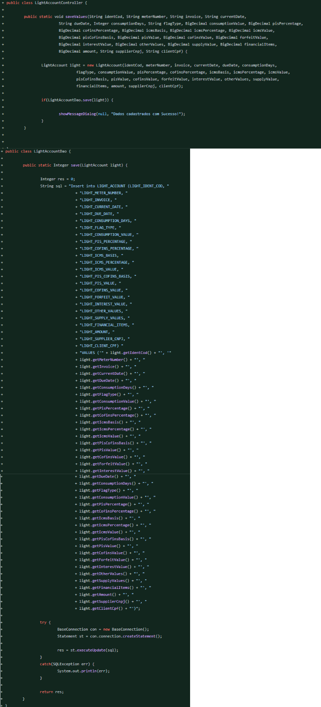
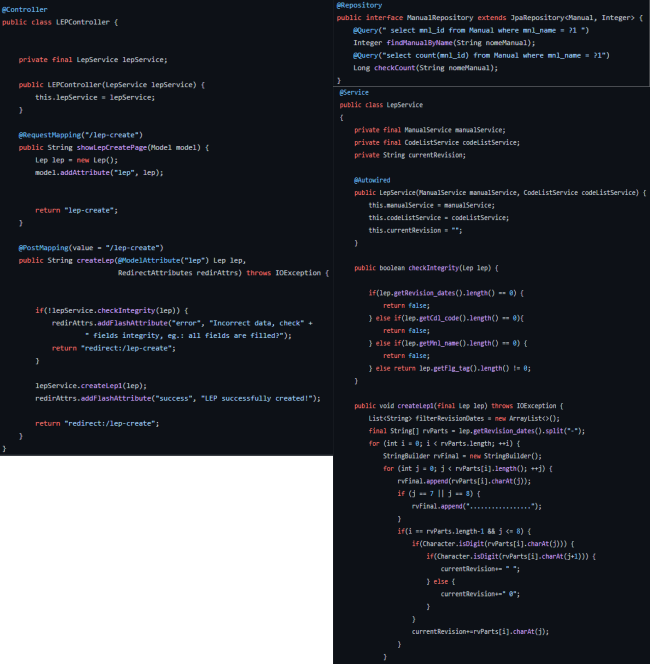

Estudante de Banco de Dados pela FATEC São José dos Campos, estagiário fullstack em Java e estas são minhas experiências no desenvolvimento da API.

# Meus Projetos

### Em 2020-1
Tabalhei no projeto proposto pelos professores das materias focais do primeiro semestre do curso de Banco de Dados, uma assistente virtual guiada por comando de voz. 
Foi dada total liberdade na escolha de tecnologia a ser utilizada no projeto e uma parceira com alunos do sexto semestre foi feita para passarem suas experiências na forma de Scrum Masters. 
Tive muita sorte pois a Ariene foi uma ótima Scrum Master orientando com grande eficácia e praticidade nossa equipe que por muitas vezes desviava do conceito inicial do projeto - tentando adicionar novas tecnologias ou <i>features</i> que não tinhamos conhecimento necessário para implementar. 
Com toda a liberdade dada - o único ponto não opicional era a implementação de, no mínimo, 5 <i>features</i> - foi interessante testar nossos conhecimentos e quebrar barreiras. 
[link para o GIT](https://github.com/arienemaiara/assistente-voz-viagens)

#### Tecnologias Utilizadas
 HTML, Javascript, CSS (os pilares do <i>frontend</i>) e GitHub

#### Contribuições Pessoais
Fui responsável pelo UI-UX, desenvolvimento das páginas e a produção de algumas <i>features</i>.

##### <i>UI-UX</i>
- Utilizei o design de cards e sombreamento para o ux, a ideia é que o usuário abra a página e já entenda que existe diferentes funções.
 

 

 

##### <i>Features</i>
- Também executei algumas das <i>features</i>:
 

 
- Mapa, função simples que usava o javaScript para mostrar o destino falado pelo usuário, documento, outra função simples para abrir uma página contendo os documentos necessários para voos nacionais e internacionais, posição, usava uma api do google para mostrar a posição do usuário no google Maps, trajeto, uma função um pouco mais complexa, mostrava o trajeto que o usuário pedia por exemplo: "São Paulo para Rio de Janeiro".

#### Hard Skills Efetivamente Desenvolvidas
HTML, Javascript, CSS e Git Flow

- <b>HTML e CSS</b>
    - Fiz toda a ui e ux do api e a implementei
- <b>javaScript</b>
    - Foi necessário aprender o básico para executar as tarefas de <b>backend</b> para as funções da tela
- <b>Git Flow</b>
    - Quem diria que algo que eu aprendi no primeiro semestre iria ajudar tanto na minha carreira! Aprendizado de Git e Git Flow foi importantíssimo!

#### Soft Skills Efetivamente Desenvolvidas
Proatividade 
Em muitos momentos precisei procurar o conhecimento, seja em vídeos de youtube, livros ou cursos, para conseguir desenvolver as <i>features</i>, design e <i>frontend</i>i>. 

### Em 2020-2
Trabalhei no projeto da API com o Parceiro Acadêmico TecSUS. 
A empresa produz soluções tecnológicas para transmissão e recepção de dados, controle, gestão de faturas e até mesmo equipamentos remotos voltados para os setores de abastecimento de água, distribuição de eletricidade e gás natural. 
Visto que a gestão de faturas pode ser algo complicado pela falta de padrão das empresas envolvidas no setor a TecSUS precisava de uma ferramenta para digitalizar um grande volume de contas. 
O projeto, Desktop App, foi feito totalmente em Java e foi focado em ajudar o processo de digitação de contas que não seguiam o padrão do sistema de digitalização automática de contas. 
Esse, sem dúvida, foi o projeto mais bem coordenado, todos os professores estavam em sintonia, assim sendo um projeto tranquilo para a implementação. 
[link para GIT](https://github.com/MikeBBatista/pi-fatec-java)

#### Tecnologias Utilizadas
Java, MySQL, IDE Eclipse Java

#### Contribuições Pessoais
Fui responsável pelo DAO - Objeto ou classe de acesso a dados, ele que conectava ao banco e fazia as transações -, como a intenção do trabalho era usar Java puro, trabalhei muito com o POO (programação orientada a objetos), lógica de programação, criação de query e JDBC para chegar até as soluções dos problemas.
##### <i>DAO</i> e <i>Controller</i>
- Nas imagens é possível ver a utilização de uma query para salvar um entidade enviada do <i>frontend</i> com alguns controles básicos de erros de banco.
 

 

#### Hard Skills Efetivamente Desenvolvidas
- <b>Java</b>
    - Nesse projeto que um dos requisitos dos professores era a utilização do Java puro pude treinar o uso de pacotes do jdk como utils e lang.
- Lógica de Programação
- <b>JDBC</b>
    - Para comunicação entre <b>backend</b> e banco de dados.
- <b>SQL</b>
    - Foi preciso escrever cada query!

#### Soft Skills Efetivamente Desenvolvidas
Trabalho em equipe 
Esse foi o projeto que mais trabalhei em equipe, ajudando membros do grupo com problemas no desenvolvimento.

### Em 2021-1
Trabalhei no projeto da API com o Parceiro Acadêmico Embraer. 
A Embraer é uma empresa renomada e importantíssima para o Brasil, produzindo aeronaves que são exportadas para dezenas de países e também utilizadas em solo brasileiro. Com o vasto arsenal de aeronaves produzidas a construção e manutenção da documentação da aeronave - que pode chegar a milhares de páginas - torna-se algo difícil, portante procuravam uma solução digital e moderna para varredura e montagem de PDFs e leitura automatizada de Excel. 
O que foi muito marcante nesse projeto foi todo o auxílio que os professores deram, em Hard Sill e Soft Skill.
[link para GIT](https://github.com/GabrielSG20/Projeto_Integrador_3BD-1Sem2021)

#### Tecnologia Utilizadas
Java SE 8, MySQL, IDE Eclipse, GitHub, IText, Maven e Framework Springboot

#### Contribuições Pessoais
Fui responsável pela maioria do <b>backend</b>, pela arquitetura MVC, regras de serviço e "raspagem" de dados.

##### Arquitetura MVC
 

 

##### Regras de Serviço
- Porém o maior desafio foi a lógica de programação para executar a raspagem de dados dos manuais em formato pdf, usei muito o pacote utils, lógica de programação e conhecimento em estruturas de dados como Listas e Mapas.
 

 
[Veja a implementação da raspagem de dados nesse link!](https://github.com/GabrielSG20/Projeto_Integrador_3BD-1Sem2021/blob/main/AirPlan/src/main/java/com/airPlan/services/PdfService.java)

##### Grande Contribuição
- Esse foi um dos projetos que mais contribui e de maneira essencial para o sucesso do grupo.
 

 

#### Hard Skills Efetivamente Desenvolvidas
- <b>JPA</b>
    - Primeira contato com essa api extremamente utilizada no mercado de trabalho Java.
- Uso de arquitetura <b>MVC</b>
    - Como o projeto foi mudando ao longo das sprints á arquitetura MVC ajudou muito para integração do código e adição de novas <i>features</i>
- Uso de bibliotecas externas como IText
    - O pronto focal do projeto era a "raspagem" de dados dos manuais portanto o uso dessa api externa foi essêncial para a finalização do projeto, assim percebi que como desenvolvedor não preciso criar tudo do zero, posso aprender a utilizar apis e ferramentas já sólidas na comunidade.
- Implementação de exceptions
    - Algo extremamente importante para tornar-se um bom programador
- <b>Spring boot</b>

#### Soft Skills
Resiliência e Autonomia 
Todo projeto possui seus gargalos e suas dificuldades porém esse foi marcado pela dificuldade.

### Em 2021-2
Trabalhei no projeto da API com o Parceiro Acadêmio Oracle. 
A Oracle é uma empresa renomada e importatíssima para o mercado tecnicologico, sempre com novas soluções para banco de dados, seja em IA ou nuvem. Essas soluções precisam ser discutidas e apresentadas por isso a Oracle Brasil possui um espaço especial para isso, a Casa Oracle. 
Com a vasta utilização da Casa Oracle a empresa precisou de um software para gestão de reuniões, participantes e palestrantes. 
Esse projeto foi caracterizado pela simplicidade porém muito marcante para o mercado de trabalho pois pedia soluções bastante utilizadas no mercado tecnicologico. 
[link para GIT](https://github.com/MaXximiles/API-4SEM)

#### Tecnologia Utilizadas
Java SE 14, GitHub, Framework Springboot, Oracle Autonomous Database , Angular e Maven.

#### Contribuições Pessoais
Fiquei encarregado de todo o <i>backend</i> do projeto e, mais tarde, da criação do banco de dados. A arquitetura que eu escolhi foi a MVC, pois, apesar de ser uma arquitetura mais antiga, ainda é muito utilizada no mercado de trabalho - pois funciona! -, desso modo trazendo um aprendizado efetivo para o meu desenvolvimento, adequa-se muito bem às soluções propostas para o problema e requer menos <i>resources</i> da parte do estudante - em uma arquitetura de micro serviços por exemplo seria difícil encontrar uma maneira de hospedar pelos menos 5 <i>end-points</i> sem pagar nada - pois, sendo estruturada de maneira monolitica, requer apenas uma hospedagem. Também optei pelo padrão <i>facade</i> ou seja, o cliente faz requisições (em JSON) para o programa portanto o <b>springboot</b> também foi o mais adequado.
##### Arquitetura
- Uma visão geral da arquitetura do programa. Já que na parte <i>View</i> foi utilizado um <i>framework</i> de <i>frontend</i> (Angular) o <i>backend</i> ficou encarregado da parte <i>Model</i> e <i>Controller</i> e outros pacotes interessantes para o projeto como <i>exception</i> para um melhor controle do fluxo do programa e <i>constant</i> para deixar o código mais legível.
 

 

##### <i>Backend</i>
- Um exemplo de uma das 3 entidades do programa, podemos ver a utilização da biblioteca <b>Lombok</b> para simplificar e manter o código mais legível eliminando código <i>boilerplate</i> (código recorrente como <i>getters</i> e <i>setters</i>), também podemos observar a utilização do <i>framework</i> <b>Hibernate</b> sendo utilizado no seu modelo <b>JPA</b> para deixar mais simples a comunicação entre o banco de dados e a camada <i>Model</i>. E na imagem 2 e 3 temos um exemplo do mapeamento das diferentes entidades, OneToOne (1-1) no caso referindo-se a um Evento sendo criado por um Usuário e ManyToMany (N-N) sendo uma lista de participantes para esse Evento.
 

 

#### Hard Skills Efetivamente Desenvolvidas
- <b>JPA</b>
    - Extremamente utilizado no mercado de trabalho Java, eu já conhecia algumas anotações e parametros mas me aprofundei muito mais nesse projeto
- Uso de constantes para deixar o código mais legível
    - Como os demais integrantes do grupo precisam ler meu código para fazer a comunicação com o <i>frontend</i> decidi dar mais atenção a essa parte e acabou sendo de grande ajuda até para mim, por exemplo: foi muito mais fácil de fazer alterações
- <b>Spring security</b>
    - Consegui fazer uma boa introdução a essa biblioteca muito utilizada no mercado de trabalho
- Banco de Dados em Cloud
    - Foi um desafio sair da zona de conforto de só baixar a instalar um banco de dados local mas valeu muito a pena
- Uso de bibliotecas externas como <b>OAuth 2.0</b> e <b>StringUtils</b>
- Implementação de exceptions
    - Algo extremamente importante para tornar-se um bom programador
- Comunicação entre <i>frontend</i> e <i>backend</i> por JSON
    - No começo do projeto participei muito do <i>frontend</i> e foi muito legal aprender sobre requisições HTML e JSON
- Envio de emails
    - Finalmente descobri como funciona!

#### Soft Skills
Organização 
Precisei de muita organização, seja na vida pessoal ou no código - para gerenciar toda a programação do <b>backend</b>.

